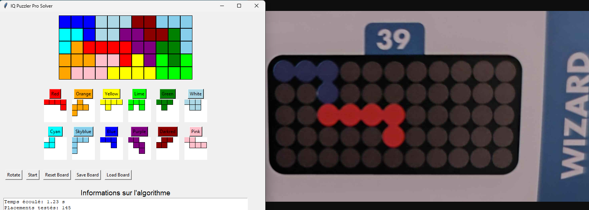

# Rapport IA41 : IQ Puzzler Pro
#### Antoine PERRIN & Traïan BEAUJARD
→ 18/20
<!-- TOC -->
## Sommaire
- [Rapport IA41 : IQ Puzzler Pro](#rapport-ia41--iq-puzzler-pro)
      - [Antoine PERRIN \& Traïan BEAUJARD](#antoine-perrin--traïan-beaujard)
  - [Sommaire](#sommaire)
  - [I/ Présentation du projet](#i-présentation-du-projet)
    - [Contextualisation](#contextualisation)
    - [Vue globale du projet](#vue-globale-du-projet)
      - [Classes](#classes)
      - [Séquences](#séquences)
      - [États et transitions](#états-et-transitions)
    - [Les outils utilisés](#les-outils-utilisés)
  - [II/ Création du jeu : Pièces et Tableau](#ii-création-du-jeu--pièces-et-tableau)
    - [Représentation des éléments du jeu](#représentation-des-éléments-du-jeu)
    - [Placer les pieces sur l'interface](#placer-les-pieces-sur-linterface)
  - [III/ L'algorithme de résolution](#iii-lalgorithme-de-résolution)
    - [Les recherches techniques](#les-recherches-techniques)
      - [Polyominos](#polyominos)
      - [Problème de couverture exacte](#problème-de-couverture-exacte)
    - [Point de départ : Algorithme X de Donald Knuth](#point-de-départ--algorithme-x-de-donald-knuth)
      - [1 - Condition d'une solution trouvée](#1---condition-dune-solution-trouvée)
      - [2 - Sélection d'une colonne avec MRV (Minimum Remaining Values)](#2---sélection-dune-colonne-avec-mrv-minimum-remaining-values)
      - [3 - Exploration des lignes couvrant la colonne sélectionnée](#3---exploration-des-lignes-couvrant-la-colonne-sélectionnée)
      - [4 - Réduction de la matrice](#4---réduction-de-la-matrice)
    - [Optimisations](#optimisations)
      - [Pruning : Exploration des zones vides](#pruning--exploration-des-zones-vides)
      - [Heuristiques : Poids des pièces](#heuristiques--poids-des-pièces)
    - [Avant / Après optimisations](#avant--après-optimisations)
    - [Projet réussi : Résolution de niveaux de IQ Puzzler Pro](#projet-réussi--résolution-de-niveaux-de-iq-puzzler-pro)
  - [IV/Interface](#ivinterface)
    - [Lancer la résolution](#lancer-la-résolution)
    - [Interface changeable](#interface-changeable)
    - [Limitations de notre interface](#limitations-de-notre-interface)
  - [VI/ Pour aller plus loin : Augmentation des dimensions de la grille](#vi-pour-aller-plus-loin--augmentation-des-dimensions-de-la-grille)
      - [Algorithme de découpe de grille en polyominos](#algorithme-de-découpe-de-grille-en-polyominos)
      - [Démonstrations de résolutions de grilles](#démonstrations-de-résolutions-de-grilles)
      - [Limitations de notre outil \& améliorations possibles](#limitations-de-notre-outil--améliorations-possibles)
  - [VII/Projet Annexes non aboutis](#viiprojet-annexes-non-aboutis)
    - [Réseau neuronal](#réseau-neuronal)
    - [Portabilité CUDA](#portabilité-cuda)
  - [Conclusion](#conclusion)

<!-- /TOC -->

## I/ Présentation du projet

### Contextualisation

Le projet porte sur le jeu IQ Puzzler Pro, un puzzle assez connu dont l’objectif est de compléter des grilles en positionnant correctement des pièces de formes variées.

Nous avons identifié trois questions fondamentales à résoudre dans ce contexte :  
- **Comment représenter les différentes pièces, en tenant compte de leurs variations possibles ?**
- **Comment résoudre efficacement les niveaux du jeu IQ Puzzler Pro ?**
- **Comment implémenter et optimiser un algorithme capable de résoudre chaque niveau le plus efficacement possible ?**

Pour débuter, nous avons commandé le jeu afin de l’explorer concrètement, l'objectif : commencer à manipuler les pièces, comprendre leurs interactions et pouvoir résoudre manuellement des niveaux du jeu initial. Cela nous à permis de réfléchir aux problématiques liées à la représentation du jeu, à la résolution et d’identifier des stratégies supposément efficaces.

Nous avons choisi de concentrer notre travail sur le mode de jeu principal, qui repose sur une grille de 5 x 11 cases et 12 pièces avec chacune au plus 8 variantes possibles (rotations et symétries incluses).

Les niveaux du jeu sont répartis en plusieurs paliers de difficultés croissantes. Grâce à nos essais pratiques et à des recherches en ligne auprès de forums de passionnés, nous avons constaté que la résolution humaine reposait sur la même stratégie : tester différentes configurations en plaçant d’abord les pièces les plus grandes, souvent le long des bords ou autour des éléments déjà positionnés.

À partir de ces observations, nous avons choisi d’implémenter un algorithme de **backtracking** avec des optimisations comme l’exploration de l’espace des solutions, et des heuristiques comme la priorisation des pièces de plus grandes tailles afin de limiter le nombre de calculs.

### Vue globale du projet

#### Classes
Voici une représentation de notre projet sous forme de diagramme de classes UML, afin de montrer une vue d’ensemble sur la conception et la structure globale.

  
*Figure 1 : Diagramme de classes UML du projet*  

Nous avons veillé à bien séparer la logique algorithmique de l’interface utilisateur. Cette séparation permet de réutiliser l’interface dans d’autres contextes, indépendamment de l’algorithme. 

L’algorithme lui-même a été structuré en plusieurs classes afin de segmenter les différents modules qui le composent pour une meilleure comprehension et lisibilité et une facilité de maintenance accrue.

#### Séquences  
Voici une représentation des interactions entre les différentes classes de notre projet, illustrée par un diagramme de séquences UML.  

    
*Figure 2 : Diagramme de séquence UML du projet*  

#### États et transitions  
Enfin, pour mieux comprendre le déroulement principal de notre programme, voici un diagramme d’états et de transitions simplifié.

  

*Figure 3 : Diagramme d’états et transitions UML du projet*  

Nous avons 3 états principaux :
- Le début : L'utilisateur choisit de placer les pièces.
- La résolution : L'algorithme cherche la solution.
- La fin : Affichage du résultat.

### Les outils utilisés

Pour la réalisation de ce projet, nous avons utilisé les outils suivants :

- **Langage de programmation : Python**
  Nous avions peur de ne pas avoir le temps d'assez explorer le projet et d'être découragés en utilisant le langage Prolog. Nous avons ainsi préféré choisir Python. Aussi le fait que Python ait des bibliothèques connues et efficaces, également assez facile d'utilisation pour tout ce qui est interface nous a fait préféré ce dernier. 

- **Interface utilisateur : Tkinter**  
  Nous avons utilisé Tkinter pour concevoir et implémenter l’interface graphique. Afin de réaliser nos premiers tests, cet outil nous a permis de rapidement visualiser nos résultats.  Nous avons ensuite continué à développer notre classe d'interface tout au long de nos avancées, et il est finalement devenu trop tard pour envisager un changement d'interface, malgré les limites liées au multithreading.

- **Gestion de version : GitHub**  
  Pour la gestion de notre projet, Github est un outil indispensable que ce soit pour le `Version Control`, le système de branches pour nos tests et le travail collaboratif.

- **Aide diverses : ChatGPT/Github Copilot**  
  Nous avons utilisé ces outils afin de nous aider dans nos recherches comme en donnant des pistes, ou vérifiant si ce que l'on avait appris était vrai et compris. Ces outils ont aussi aidé pour la documentation Python de certains modules comme pour l'interface, et la rédaction des commentaires. 

## II/ Création du jeu : Pièces et Tableau

### Représentation des éléments du jeu

Le tableau est simple à représenter : c'est une matrice de la taille du plateau, `5x11`.

```python
class Plateau:
    def __init__(self, lignes=5, colonnes=11):
        self.lignes = lignes  
        self.colonnes = colonnes  
        self.plateau = np.zeros((lignes, colonnes), dtype=int) # remplissage du tableau avec des 0
```

Puis, pour faciliter l’interaction avec ce dernier, nous avons ajouté 3 méthodes explicites :

```python
    def placer_piece(self, piece, variante_index, position):
    def peut_placer(self, variante, position):
    def retirer_piece(self, piece, variante_index, position):
```

Afin de représenter les pièces, nous devons avoir le **nom** de la pièce pour la couleur, ainsi que sa **forme de base** représentée par une matrice.

```python
class Piece:
    def __init__(self, nom, forme_base):
        self.nom = nom
        self.forme_base = np.array(forme_base)
        self.variantes = self.generer_variantes()
```

Pour que l'algorithme puisse utiliser les variantes, nous avons implémenté une méthode qui vient retourner les au plus **8 variantes** possibles. Selon les pièces, une variante peut redonner la même forme qu'une autre variante précédemment calculée. De ce fait, nous enlevons à la fin les doublons pour éviter la redondance de calculs.

```python
    def generer_variantes(self):
        variantes = []
        for i in range(4):  # (0°, 90°, 180°, 270°)
            rotation = np.rot90(self.forme_base, i)
            variantes.append(rotation)
            # symétrie horizontale
            symetrie = np.fliplr(rotation)
            variantes.append(symetrie)

        # retire les doublons
        variantes_uniques = []
        for var in variantes:
            if not any(np.array_equal(var, existante) for existante in variantes_uniques):
                variantes_uniques.append(var)

        return variantes_uniques
```

### Placer les pieces sur l'interface

Désormais,  l'utilisateur doit pouvoir placer les pièces souhaitées pour son niveau. 
L'explication complète de l'interface sera faite dans une autre partie. Ici nous nous contenterons de seulement expliquer les parties essentielles pour le placement des pièces.

*explications des méthodes de la classe interface liées au placement*

## III/ L'algorithme de résolution

### Les recherches techniques

Comme expliqué dans l'introduction, le choix d'un algorithme de type **backtracking** nous semblait pertinent, mais c'était la seule notion que nous connaissions. Nous avons ainsi commencé à faire des recherches plus techniques afin de mieux comprendre les concepts mathématiques et informatiques associés au projet.

#### Polyominos
En premier lieu, les pièces du jeu IQ Puzzle Pro sont mathématiquement appelés des "Polyominos". C'est une forme crée par des carrés connectés où chaque carré est adjacent à au moins un autre.
[Source](https://fr.wikipedia.org/wiki/Polyomino)  


*Figure 4 : Les 12 polyominos du jeu IQ Puzzler Pro*  

#### Problème de couverture exacte
Ensuite, notre projet correspond à un **problème de couverture exacte** ou encore un **problème de satisfaction de contraintes (CSP)**. Ce type de problème consiste à couvrir intégralement un ensemble donné (le tableau du jeu) à l’aide de sous-ensembles spécifiques (les polyominos), sans qu’aucun ne se chevauche.  [Source](https://fr.wikipedia.org/wiki/Probl%C3%A8me_de_la_couverture_exacte) <br>
Ce problème est un problème **NP-complet**, c'est à dire qu’il est difficile à résoudre de manière optimale en raison de sa complexité temporelle. Trouver une solution rapide pour des instances de grande taille devient rapidement impraticable.

En effet, on pourrait simplifier la complexité temporelle de notre problème tel que : <br> 
**O(b^d)** <br>
où : 
**b** est le facteur de branchement, c'est-à-dire le nombre moyen de choix possibles à chaque étape (ici, les pièces à placer avec leurs variantes).<br>
et
**d** est la profondeur maximale de l’arbre de recherche (ici, le nombre de pièces à placer).

**CSP :**

**Variables (X):**
- 12 pièces à placer, chacune définie par un tuple `(x, y, r)` 
- `(x,y)` : position de la pièce
- `r` : numéro de la variante (rotation/symétrie)

**Domaines (D):**  
```
x ∈ [0,10] : position horizontale 
y ∈ [0,4]  : position verticale
r ∈ [0,7]  : indice de variante
```

**Contraintes (C):**
- Pas de superposition entre les pièces
- La grille doit être entièrement remplie
- Chaque pièce doit être utilisée exactement une fois

Ainsi, une solution est valide si et seulement si toutes les contraintes sont respectées.


  
*Figure 5 : Exemple de couverture des polyominos*  

### Variables d'états
Nous devrons utiliser les variables d'états suivantes:
- État du plateau (matrice représentant les cellules occupées)
- Liste des pièces placées
- Liste des pièces restantes
- Points de décision (choix de placement possibles)

```sh
Plateau : Matrice (5x11) 
    S = {-1, 0, …, N} où N est le nombre de pièces.

Pièces : Matrices (4x4)
    P = {0, i} où i est le numéro de la pièce.

Suivi des pièces : Dict[str, Info]  # "rouge": {pos:(0,0), var:2} 

Condition de fin : 
    ∄ case = -1
    ∀ i ∈ [0,N] présent une fois
    Positions entre Dict et le Plateau cohérentes
```

### Point de départ : Algorithme X de Donald Knuth

L’algorithme X, proposé par Donald Knuth, est conçu pour résoudre des **problèmes de couverture exacte**. Dans notre projet, il permet de déterminer les placements valides des pièces sur le plateau du jeu IQ Puzzler Pro tout en respectant les contraintes du puzzle.

#### 1 - Condition d'une solution trouvée  

La première étape de l'algorithme consiste à vérifier si la matrice de contraintes est vide. Une matrice vide indique que toutes les contraintes ont été satisfaites, donc une solution a été trouvée.  

```python
if not matrix:  # si la matrice est vide
    validator = SolutionValidator(self.pieces, self.plateau)
    if validator.validate_solution(solution):  # on vérifie la solution
        self.solutions.append(solution.copy())  # on ajoute notre solution trouvée
        return True
    return False
```

- La méthode `validate_solution` de la classe SolutionValidator est utilisée pour s'assurer que la solution est correcte en vérifiant :
    - Que chaque pièce est utilisée une seule fois.
    - Qu'aucune cellule n'est couverte par deux pièces (pas de chevauchement).
    - Que toutes les cellules du plateau sont couvertes (solution complète).
- Si une solution est valide, elle est ajoutée à la liste des solutions.
    - Note : Notre classe est prévue pour lister toutes les solutions possibles. Cependant, dans le contexte de notre projet où nous devons trouver qu'une solution au puzzle, depuis une classe extérieure, nous demandons d'arrêter l'algorithme dès la première solution trouvée.

#### 2 - Sélection d'une colonne avec MRV (Minimum Remaining Values)

Si la matrice n'est pas vide, l'algorithme sélectionne une colonne. Nous utilisons l’heuristique **MRV (Minimum Remaining Values)**, qui choisit la colonne ayant le moins d'options possibles.   
Cette approche vise à réduire l’espace de recherche en choisissant en priorité les contraintes les plus difficiles à satisfaire.

**Fonctionnement**

La méthode `select_min_column` compte, pour chaque colonne, le nombre de lignes qui la couvrent. La colonne avec le plus petit nombre est sélectionnée, car elle représente la contrainte la plus restrictive.

Admettons une matrice de contraintes où :  
- Les colonnes représentent des cellules du plateau.  
- Les lignes représentent des placements possibles. 

<table style="border-collapse: collapse; border: 2px solid rgb(140 140 140); letter-spacing: 0.5px; margin-left: 40px;">
    <thead style = "background-color: rgb(228 240 245);">
        <tr style = "border: 1px solid black;">
            <th style = "text-align: center;" scope="col">Lignes / Colonnes </th>
            <th style = "text-align: center;" scope="col">A</th>
            <th style = "text-align: center;" scope="col">B</th>
            <th style = "text-align: center;" scope="col">C</th>
            <th style = "text-align: center;" scope="col">D</th>
        </tr>
    </thead>
    <tbody>
        <tr style = "border: 1px solid rgb(160 160 160); padding: 8px 10px; background-color: rgb(245, 245, 245);">
            <td scope="row" style = "border: 1px solid rgb(160 160 160); padding: 8px 10px;">Placement 1</td>
            <td style = "border: 1px solid rgb(160 160 160); padding: 8px 10px;">1</td>
            <td style = "border: 1px solid rgb(160 160 160); padding: 8px 10px;">0</td>
            <td style = "border: 1px solid rgb(160 160 160); padding: 8px 10px;">1</td>
            <td style = "border: 1px solid rgb(160 160 160); padding: 8px 10px;">0</td>
        </tr>
        <tr style = "border: 1px solid rgb(160 160 160); padding: 8px 10px; background-color: rgb(228, 240, 245)">
            <td style = "border: 1px solid rgb(160 160 160); padding: 8px 10px;" scope="row">Placement 2</td>
            <td style = "border: 1px solid rgb(160 160 160); padding: 8px 10px;">0</td>
            <td style = "border: 1px solid rgb(160 160 160); padding: 8px 10px;">1</td>
            <td style = "border: 1px solid rgb(160 160 160); padding: 8px 10px;">1</td>
            <td style = "border: 1px solid rgb(160 160 160); padding: 8px 10px; ">0</td>
        </tr>
        <tr style = "border: 1px solid rgb(160 160 160); padding: 8px 10px; background-color: rgb(245, 245, 245);">
            <td style = "border: 1px solid rgb(160 160 160); padding: 8px 10px;" scope="row">Placement 3</td>
            <td style = "border: 1px solid rgb(160 160 160); padding: 8px 10px;">0</td>
            <td style = "border: 1px solid rgb(160 160 160); padding: 8px 10px;">0</td>
            <td style = "border: 1px solid rgb(160 160 160); padding: 8px 10px;">1</td>
            <td style = "border: 1px solid rgb(160 160 160); padding: 8px 10px;">1</td>
        </tr>
    </tbody>
</table>

- La colonne A est couverte par 1 ligne.  
- La colonne B est couverte par 1 ligne.  
- La colonne C est couverte par 3 lignes.  
- La colonne D est couverte par 1 ligne.  

L'heuristique MRV choisit une colonne parmi A, B, ou D, car elles ont le moins de lignes associées.

```python
def select_min_column(self, matrix, header):
    """
    Sélectionne la colonne avec le moins d'options (heuristique MRV).
    """
    counts = [0] * len(header)  # compteur par colonne

    # parcourt la matrice pour compter les couvertures par colonne
    for row in matrix:
        for idx, val in enumerate(row['row']):
            if val == 1:
                counts[idx] += 1  # incrémente le compteur pour chaque occurrence

    # remplace les colonnes non couvertes par une valeur infinie
    counts = [c if c > 0 else float('inf') for c in counts]

    # sélectionne la colonne avec le minimum d'options
    m = min(counts)
    if m == float('inf'):  # Si aucune colonne n'est disponible
        return None
    return counts.index(m)  # Retourne l'indice de la colonne choisie
```

Si aucune colonne n’est couverte, cela signifie que la matrice est incohérente, et l'algorithme retourne `None` pour faire un retour arrière.
```python
column = self.select_min_column(matrix, header)  # sélectionne la colonne la plus contraignante
if column is None:  # aucune colonne n'est disponible : retour en arrière
    return False
```

#### 3 - Exploration des lignes couvrant la colonne sélectionnée  

Une fois une colonne choisie, l’algorithme identifie toutes les lignes qui couvrent cette colonne. Chaque ligne correspond à un placement possible pour une pièce. L'algorithme essaye ces placements un par un.  

```python
rows_to_cover = [row for row in matrix if row['row'][column] == 1]  # récupère les lignes couvrant la colonne
```

Un tri des lignes peut être effectué pour prioriser les options les plus probables :  

```python
def prioritize_rows(self, rows):
    rows.sort(key=lambda r: -self.piece_weights[r['piece'].nom])  # Tri décroissant par poids
    return rows
```

Chaque ligne est ensuite testée :  

```python
for row in rows_to_cover:
    solution.append(row)  # ajout de la ligne à la solution actuelle
    new_matrix = self.cover_columns(matrix, columns_to_remove, row)  # réduction de la matrice

    if self.algorithm_x(new_matrix, header, solution):  # Appel récursif
        return True
    solution.pop()  # Retour arrière
```

#### 4 - Réduction de la matrice  

Après avoir choisi une ligne (un placement), l’algorithme réduit la matrice en supprimant :  
1. Toutes les colonnes couvertes par cette ligne.  
2. Toutes les lignes conflictuelles (celles qui couvrent les mêmes colonnes).  

```python
def cover_columns(self, matrix, columns_to_remove, selected_row):
    new_matrix = []
    for r in matrix:
        if r == selected_row:  # ignore la ligne sélectionnée
            continue
        if all(r['row'][idx] == 0 for idx in columns_to_remove):  # conserve les lignes non conflictuelles
            new_matrix.append(r)
    return new_matrix
```
- Si la colonne A est couverte par la ligne sélectionnée, toutes les lignes contenant A sont supprimées.  

```python
def algorithm_x(self, matrix, header, solution):
    # Étape 1 : Vérification de solution
    if not matrix:  # si la matrice est vide
        validator = SolutionValidator(self.pieces, self.plateau)
        if validator.validate_solution(solution):  # Valide la solution trouvée
            self.solutions.append(solution.copy())  # Ajoute la solution ce qui déclenchera la fin dans notre projet.
            return True
        return False # retour arrière

    # Étape 2 : Sélectionner une colonne (heuristique MRV)
    column = self.select_min_column(matrix, header)
    if column is None:  # Aucune colonne disponible
        return False # retour arrière

    # Étape 3 : Récupérer les lignes couvrant la colonne
    rows_to_cover = [row for row in matrix if row['row'][column] == 1]
    rows_to_cover = self.prioritize_rows(rows_to_cover)  # Tri optionnel des lignes

    for row in rows_to_cover:  # Tester chaque ligne
        solution.append(row)  # Ajouter le placement à la solution
        columns_to_remove = [idx for idx, val in enumerate(row['row']) if val == 1]
        new_matrix = self.cover_columns(matrix, columns_to_remove, row)  # Réduire la matrice

        # Étape 4 : Appel récursif
        if self.algorithm_x(new_matrix, header, solution):
            return True
        solution.pop()  # Retour arrière si échec

    return False  # retour arrière
```

Maintenant, testons notre algorithme :


*Figure : Niveau 3 du jeu résolu en 25 placements testés*



*Figure : Niveau 39 du jeu résolu en 145 placements testés*


### Optimisations

Pour améliorer les performances de l'algorithme X, nous avons intégré des stratégies d'optimisation. Ces ajouts permettent de réduire l’espace de recherche, de prioriser des placements et d’effectuer un **pruning** (coupure) des branches non valides.

---

#### Pruning : Exploration des zones vides

L’exploration des zones est un élément clé dans l'optimisation de notre algorithme. L'objectif est d'identifier des configurations intermédiaires qui rendent impossible la résolution du puzzle. Cela permet un pruning (coupure) des branches non valides, améliorant ainsi la rapidité de l'algorithme.

En effet, à chaque nouveau placement, nous vérifions s'il n'existe pas de zone vide (trous) impossibles à remplir avec les polyominos restants afin de directement couper la branche invalide.

---

**Test de la solution :**  
La méthode `apply_solution_to_plateau` applique les placements actuels à une copie du plateau, marquant les cellules occupées.

```python
def apply_solution_to_plateau(self, solution):
    """
    Applique la solution actuelle à un plateau temporaire pour simuler l'état.
    
    Paramètres :
    - solution : Liste des placements effectués.

    Retourne :
    - plateau_temp : Copie du plateau avec les cellules occupées.
    """
    plateau_temp = np.copy(self.plateau.plateau)  # Copie de l'état actuel du plateau
    for sol in solution:
        for cell in sol['cells_covered']:  # Marque les cellules occupées par la solution
            i, j = cell
            plateau_temp[i, j] = 1
    return plateau_temp
```

---

**Identification des zones vides :**  
Les zones vides sont détectées en explorant le plateau temporaire pour identifier les cellules contiguës non occupées. La méthode `explore_zone` utilise un parcours en largeur (BFS) pour regrouper les cellules d’une même zone.

```python
def get_empty_zones(self, plateau_temp):
    """
    Identifie les zones vides (ensembles de cellules contiguës non occupées).

    Paramètres :
    - plateau_temp : Plateau temporaire avec la solution appliquée.

    Retourne :
    - empty_zones : Liste des zones vides, chaque zone étant une liste de cellules (i, j).
    """
    visited = set()  # Ensemble pour suivre les cellules déjà explorées
    empty_zones = []  # Liste des zones vides identifiées
    for i in range(self.plateau.lignes):
        for j in range(self.plateau.colonnes):
            if plateau_temp[i, j] == 0 and (i, j) not in visited:  # Cellule vide non visitée
                zone = self.explore_zone(plateau_temp, i, j, visited)  # Explore la zone
                empty_zones.append(zone)  # Ajoute la zone à la liste
    return empty_zones
```

```python
def explore_zone(self, plateau_temp, i, j, visited):
    """
    Parcours une zone vide en partant d'une cellule initiale.

    Paramètres :
    - plateau_temp : Plateau temporaire.
    - i, j : Coordonnées de la cellule de départ.
    - visited : Ensemble des cellules déjà explorées.

    Retourne :
    - zone : Liste des cellules formant la zone vide explorée.
    """
    queue = [(i, j)]  # Initialisation de la file pour BFS
    visited.add((i, j))  # Marque la cellule comme visitée
    zone = [(i, j)]  # Liste des cellules de la zone actuelle
    while queue:
        ci, cj = queue.pop(0)  # Récupère la cellule actuelle
        for ni, nj in [(ci+1, cj), (ci-1, cj), (ci, cj+1), (ci, cj-1)]:  # Directions (haut, bas, gauche, droite)
            if 0 <= ni < self.plateau.lignes and 0 <= nj < self.plateau.colonnes:
                if plateau_temp[ni, nj] == 0 and (ni, nj) not in visited:  # Cellule vide non visitée
                    visited.add((ni, nj))  # Marque comme visitée
                    queue.append((ni, nj))  # Ajoute à la file
                    zone.append((ni, nj))  # Ajoute à la zone
    return zone
```

---

**Validation des zones :**  
Une fois les zones vides identifiées, elles sont comparées aux tailles des pièces restantes. Si une zone ne peut pas être comblée exactement, la branche est coupée.

```python
def has_unfillable_voids(self, solution):
    """
    Vérifie si une solution partielle conduit à des zones impossibles à remplir.

    Paramètres :
    - solution : Liste des placements actuels.

    Retourne :
    - bool : True si une zone est impossible à remplir, False sinon.
    """
    plateau_temp = self.apply_solution_to_plateau(solution)  # Applique la solution courante
    empty_zones = self.get_empty_zones(plateau_temp)  # Identifie les zones vides
    remaining_sizes = [np.count_nonzero(self.pieces[p].forme_base) for p in remaining_pieces]  # Tailles des pièces restantes

    for zone in empty_zones:
        zone_size = len(zone)  # Taille de la zone vide
        if zone_size in self.zone_cache:  # Vérifie dans le cache si cette taille est comblable
            if not self.zone_cache[zone_size]:
                return True  # Zone non comblable détectée
        else:
            possible = self.is_zone_fillable(zone_size, remaining_sizes)  # Vérifie via subset sum
            self.zone_cache[zone_size] = possible  # Met à jour le cache
            if not possible:
                return True
    return False
```

---

**Vérification via la somme des sous-ensembles : *Subset Sum***

L’objectif de cette étape est de vérifier si une zone vide de taille donnée peut être comblée par une combinaison de tailles des pièces restantes. Cette vérification repose sur une approche de **programmation dynamique**, appelée *Subset Sum*, qui détermine si une somme spécifique (taille de la zone) peut être atteinte avec les éléments d’un ensemble (tailles des pièces restantes).

**Tableau dynamique (`dp`)** :  
- `dp[i]` est `True` si une combinaison de pièces permet de former une zone de taille `i`.
 - Initialisation : `dp[0] = True` (une zone de taille 0 peut toujours être remplie).  

**Mise à jour du tableau** :  
- Pour chaque taille de pièce, le tableau est mis à jour de manière descendante (du plus grand vers 0). Cela évite de compter plusieurs fois une même pièce.

**Résultat final** :  
Si `dp[zone_size]` est `True`, la zone est comblable. Sinon, elle ne peut pas être remplie exactement.

```python
def can_fill_zone(self, zone_size, piece_sizes):
    """
    Vérifie si une zone de taille donnée peut être comblée par une combinaison des pièces restantes.

    Paramètres :
    - zone_size : Taille de la zone vide.
    - piece_sizes : Liste des tailles (nombre de cellules) des pièces restantes.

    Retourne :
    - bool : True si la zone est remplissable exactement, False sinon.
    """
    dp = [False] * (zone_size + 1)  # initialisation du tableau dynamique
    dp[0] = True

    for size in piece_sizes:
        for i in range(zone_size, size - 1, -1):  # Parcours descendant pour éviter les doublons
            dp[i] = dp[i] or dp[i - size]  # TRUE si (taille actuelle - taille de la pièce) est atteignable

    return dp[zone_size]
```

**Exemple :**
- Zone vide : taille 7.  
- Pièces restantes : tailles [2, 3, 6].  

1. Initialisation : `dp = [True, False, False, False, False, False, False, False]`.  
2. Ajout de la pièce 2 : `dp = [True, False, True, False, False, False, False, False]`.  
3. Ajout de la pièce 3 : `dp = [True, False, True, True, False, True, False, False]`.  
4. Ajout de la pièce 6 : `dp = [True, False, True, True, False, True, True, True]`.  
5. `dp[7] = True`. La zone peut être remplie avec les pièces [2, 3, 2].  

#### Heuristiques : Poids des pièces

Dans l'introduction, nous avions expliqué qu'il était plus efficace de commencer par les pièces les plus grandes. De cette observation, nous avons implémenter un choix de priorisation des placements des pièces. Nous définissons un poids à chaque polyomino selon la priorité choisie : 

|Heuristique|Priorité|
|:--|:---|
|ascender            |Petites pièces (air).|
|descender           |Grandes pièces (air).|
|compactness	     |Pièces compactes.|
|compactness_inverse |Pièces non compactes (grandes disparités largeur/hauteur)|
|perimeter	         |Petits périmètres.|
|perimeter_inverse   |Grands périmètres.|
|holes	             |Pièces avec peu de trous internes.|
|holes_inverse       |Pièces avec plus de trous internes.|

Certaines des heuristiques du tableau ne semblent pour le moment non pertinentes pour les pièces du IQ Puzzler Pro. Cependant, elles se révéleront utiles dans une partie suivante.

```python
def calculate_piece_weights(self, heuristic="ascender"):
    weights = {}
    #pour chaque piece
    for piece in self.pieces.values():
        if not hasattr(piece, 'forme_base') or piece.forme_base is None:
            weights[piece.nom] = float('inf')
            continue

        occupied_cells = np.count_nonzero(piece.forme_base)  # nombre de cellules occupées.
        if occupied_cells == 0:
            weights[piece.nom] = float('inf')
            continue

        # calcul des critères
        shape = piece.forme_base
        height, width = shape.shape
        compactness = min(height, width) / max(height, width)  # Ratio compact.
        perimeter = np.sum(np.pad(shape, pad_width=1, mode='constant', constant_values=0) != 0) - occupied_cells
        holes = np.sum(shape == 0)  # zones vides dans la forme.
```
```python
        #assignation du poids selon le type choisi.
        if heuristic == "ascender":
            weights[piece.nom] = 1 / occupied_cells
        elif heuristic == "descender":
            weights[piece.nom] = occupied_cells
        elif heuristic == "compactness":
            weights[piece.nom] = compactness
        elif heuristic == "compactness_inverse":
            weights[piece.nom] = 1 / (compactness + 1e-6)
        elif heuristic == "perimeter":
            weights[piece.nom] = 1 / perimeter if perimeter > 0 else float('inf')
        elif heuristic == "perimeter_inverse":
            weights[piece.nom] = perimeter
        elif heuristic == "holes":
            weights[piece.nom] = 1 / (holes + 1)
        elif heuristic == "holes_inverse":
            weights[piece.nom] = holes
        else:
            raise ValueError(f"Unknown heuristic: {heuristic}")
    return weights
```

Analysons les résultats pour un niveau.


*Figure : Un même niveau résolu avec les différentes heuristiques*

  

*Figure : Comparaison Temps et nombre de placements testés entre chaque heuristique*

On remarque des différences notables, montrant que notre choix d'incorporer ces heuristiques est une stratégie efficace et pertinente.
De manière générale, l'heuristique "Descender" est la plus efficace, c'est celle qui vise à placer les plus grandes pièces en premier.
Cependant, comme toute heuristique, qui sert à guider le résultat, cette dernière peut ne pas être la plus efficace dans certains cas.

### Avant / Après optimisations

Pour commencer, comparons la version optimisée et la version de départ.

  

*Figure : Comparaison résolution d'un niveau*

Comparons les différences :
- Temps : Cette valeur est très différente car nous avons retiré l'affichage de la résolution de la grille en temps réel afin de gagner en performance.
Nous enregistrons désormais chaque placement dans une liste afin de rejouer les étapes une fois la résolution finie.
- Placements testés : Cette valeur est importante, et nous voyons ici que nous les avons réduit de moitié (145 vs 73). Les optimisations sont donc efficaces.

### Projet réussi : Résolution de niveaux de IQ Puzzler Pro

Nous avons désormais montré que notre projet était fonctionnel : il est capable de résoudre des niveaux en quelques (dizaines de) millisecondes de manière efficace.
Avec une base de projet solide, nous avons souhaité aller plus loin. Pour cela, nous allons rapidement expliqué certains points clés de l'interface. 

## IV/Interface

L'explication de cette partie permet de comprendre l'utilisation de notre classe AlgorithmX. 

### Lancer la résolution

La classe de l'interface contient de nombreuses méthodes, mais seulement une nous intéresse : `start_resolution()`. Cette dernière interagit avec le stack gérant l'algorithme :
```python
    def start_resolution(self):
        # réinitialise les variables précédentes
        self.step_progress_label.config(text="") 
        self.solution = []

        # ajoute les pieces placées comme pieces fixes
        fixed_pieces = {}
        for piece_name, info in self.placed_pieces.items():
            fixed_pieces[piece_name] = {
                'variante_index': info['variante_index'],
                'position': info['position']
            }
```
```python
        # Créer un nouvel objet Plateau pour le résoudre
        plateau_copy = Plateau()
        plateau_copy.lignes = self.grid_y
        plateau_copy.colonnes = self.grid_x
        plateau_copy.plateau = np.copy(self.plateau.plateau)
        heuristic = self.heuristic_choice.get()

        # lance la résolution
        self.manager = SolverManager(
            plateau_copy,
            self.pieces,
            heuristic,
            fixed_pieces
        )

        # désactive l'interaction de certains controls
        self.disable_controls()
        self.is_solving = True

        # manager lance dans un thread
        self.manager_thread = threading.Thread(target=self.manager.run)
        self.manager_thread.start()
        self.update_feedback()
```

Pour lancer une résolution, il suffit simplement de donner les paramètres attendus par le SolverManager :
```python
        # Lance la résolution
        self.manager = SolverManager(
            plateau_copy, # objet Plateau
            self.pieces,  # dictionnaire des pièces à placer
            heuristic,    # string du nom heuristique
            fixed_pieces  # dictionnaire des pièces placées (optionnel)
        )
```    

Nous lançons la résolution dans un thread à part afin de pouvoir récupérer dans le thread principal de l'interface les statistiques et le temps écoulé en direct.

```python
        # manager lance dans un thread
        self.manager_thread = threading.Thread(target=self.manager.run)
        self.manager_thread.start()
```

### Interface changeable

Ainsi, nous avons vu que le lancement de la résolution est très simple à utiliser.
En effet, nous avons choisi une architecture de classes modulaires dans le cas où nous voulions changer l'interface.

    
*Figure : Diagramme de séquence UML simplifié du projet* 

Dans cette architecture, nous pouvons facilement choisir une autre librairie python, ou alors créer une passerelle vers un autre langage permettant plus permissif que Tkinter. 

### Limitations de notre interface

En effet, une fois la résolution optimisée fonctionnelle, nous avons voulu encore augmenter l'efficacité de notre algorithme en utilisant le multi-threading.
Cependant, il est très difficile d'exploiter le multi-threading avec Tkinter.
Malgré le fait que l'interface soit censée être indépendante, nous avons rencontré de nombreuses difficultés à faire fonctionner le parallélisme de notre algorithme.
Si nous devions refaire l'interface en C++, nous aurions bien plus de facilité à intégrer le multi-threading car ce langage permet une meilleure gestion du parallélisme.

## VI/ Pour aller plus loin : Augmentation des dimensions de la grille

Étant donné que le programme fonctionnait déjà pour des grilles de `5x11`, nous avons voulu tester les limites de notre algorithme.
Notamment en augmentant la taille de la grille, et tester de résoudre n'importe quelle configuration de polyominos sur une grille de taille `x` et `y` variable.
Alors, nous avons premièrement découpé manuellement un plateau `6x12` pour faire 14 pièces de formes différentes.
Nous avons implémenté ces pièces dans notre programme, et lancé la résolution.


*Figure : Grille découpée en 14 polyominos*

On a lancé la résolution sans aucune pièce placée Avec 2 heuristiques différentes (Descender, Ascender).

  

*Figure : Nouvelle grille et pièces implémentées*

Notre hypothèse est validée, bien que logique et prédictible, nous pouvons ne pas nous limiter à la grille par défaut du jeu IQ Puzzler Pro, et ainsi s'amuser sur de plus grandes grilles.

#### Algorithme de découpe de grille en polyominos

Afin de ne pas avoir à créer manuellement chaque découpage, nous avons conçu un algorithme pour découper une grille de taille X et Y en Z polyominos tout en favorisant l'unicité de ces derniers.

**Procédé :**
- On initialise une grille vide de taille X×Y.
- Pour chaque cellule non visitée :
   - On crée un polyomino de taille aléatoire.
   - On étend le polyomino en ajoutant des cellules adjacentes jusqu'à atteindre la taille souhaitée.
   - Si la taille souhaitée n'est pas atteinte, annuler le polyomino.
- On rempli les cellules vides restantes en les assignant au plus petit polyomino voisin.


**Exemple :**
Grille 3x3
**Création des polyominos pas à pas :**

<div style="display: flex; justify-content: space-between; align-items: center; font-size: 0.8em;">
    <div>
        <p>1. Initialisation</p>
        <table>
            <tr><td> </td><td>0</td><td>1</td><td>2</td></tr>
            <tr><td>0</td><td>-1</td><td>-1</td><td>-1</td></tr>
            <tr><td>1</td><td>-1</td><td>-1</td><td>-1</td></tr>
            <tr><td>2</td><td>-1</td><td>-1</td><td>-1</td></tr>
        </table>
    </div>
    →
    <div>
        <p>2. 1er polyomino A</p>
        <table>
            <tr><td> </td><td>0</td><td>1</td><td>2</td></tr>
            <tr><td>0</td><td>A</td><td>A</td><td>-1</td></tr>
            <tr><td>1</td><td>-1</td><td>-1</td><td>-1</td></tr>
            <tr><td>2</td><td>-1</td><td>-1</td><td>-1</td></tr>
        </table>
    </div>
    →
    <div>
        <p>3. 2e polyomino B</p>
        <table>
            <tr><td> </td><td>0</td><td>1</td><td>2</td></tr>
            <tr><td>0</td><td>A</td><td>A</td><td>B</td></tr>
            <tr><td>1</td><td>-1</td><td>B</td><td>B</td></tr>
            <tr><td>2</td><td>-1</td><td>-1</td><td>-1</td></tr>
        </table>
    </div>
    →
    <div>
        <p>4. 3e polyomino C</p>
        <table>
            <tr><td> </td><td>0</td><td>1</td><td>2</td></tr>
            <tr><td>0</td><td>A</td><td>A</td><td>B</td></tr>
            <tr><td>1</td><td>C</td><td>B</td><td>B</td></tr>
            <tr><td>2</td><td>C</td><td>C</td><td>-1</td></tr>
        </table>
    </div>
    →
    <div>
        <p>5. 4e polyomino D</p>
        <table>
            <tr><td> </td><td>0</td><td>1</td><td>2</td></tr>
            <tr><td>0</td><td>A</td><td>A</td><td>B</td></tr>
            <tr><td>1</td><td>C</td><td>B</td><td>B</td></tr>
            <tr><td>2</td><td>C</td><td>C</td><td>-1</td></tr>
        </table>
    </div>
    →
    <div>
        <p>6. Fusion cases vides</p>
        <table>
            <tr><td> </td><td>0</td><td>1</td><td>2</td></tr>
            <tr><td>0</td><td>A</td><td>A</td><td>B</td></tr>
            <tr><td>1</td><td>C</td><td>B</td><td>B</td></tr>
            <tr><td>2</td><td>C</td><td>C</td><td>B</td></tr>
        </table>
    </div>
</div>


**Implémentation :**

1. **Initialisation :** Création d'une grille vide et d'une liste pour stocker les polyominos générés.

```python
def __init__(self, rows, cols, max_pieces=50):
    self.rows = rows
    self.cols = cols
    self.grid = [[-1 for _ in range(cols)] for _ in range(rows)] #-1 partout

    self.polyominos = []
    self.max_pieces = min(max_pieces, len(self.PIECE_COLORS))
```

2. **Génération des polyominos :** Pour chaque cellule non visitée, on tente de créer un nouveau polyomino de taille aléatoire.

```python
def generate(self):
    # Grille pour suivre les cellules visitées
    visited = [[False for _ in range(self.cols)] for _ in range(self.rows)]
    label = 0  # label pour chaque polyomino

    for i in range(self.rows): # Création de chaque polyomino
        for j in range(self.cols):
            if not visited[i][j] and label < self.max_pieces:
                size = random.randint(2, min(self.rows, self.cols))
                polyomino = self._create_polyomino(i, j, size, visited, label) # Création du polyomino
                if polyomino:
                    self.polyominos.append(polyomino)
                    label += 1

    self._fill_remaining_cells() # Remplissage des cases restantes
```

3. **Création d'un polyomino :** À partir d'une position de départ, on étend le polyomino en ajoutant des cellules adjacentes jusqu'à atteindre la taille souhaitée.

```python
def _create_polyomino(self, start_x, start_y, size, visited, label):
    """
    Crée un polyomino à partir d'une position de départ.

    Paramètres:
    - start_x (int): Ligne de départ.
    - start_y (int): Colonne de départ.
    - size (int): Taille souhaitée du polyomino.
    - visited (list): Grille des cellules visitées.
    - label (int): Étiquette du polyomino.

    Retourne:
    - list: Liste des coordonnées du polyomino ou None si impossible.
    """
    directions = [(0, 1), (1, 0), (0, -1), (-1, 0)]  # Droite, Bas, Gauche, Haut
    queue = deque([(start_x, start_y)])
    polyomino = []

    while queue and len(polyomino) < size:
        x, y = queue.popleft()
        if 0 <= x < self.rows and 0 <= y < self.cols and not visited[x][y]:
            visited[x][y] = True
            self.grid[x][y] = label
            polyomino.append((x, y))

            random.shuffle(directions)  # Mélange des directions pour l'aléatoire
            for dx, dy in directions:
                nx, ny = x + dx, y + dy
                if 0 <= nx < self.rows and 0 <= ny < self.cols and not visited[nx][ny]:
                    queue.append((nx, ny))

    # Si on n'a pas pu atteindre la taille souhaitée, annuler
    if len(polyomino) < size:
        for x, y in polyomino:
            visited[x][y] = False
            self.grid[x][y] = -1
        return None

    return polyomino
```

4. **Remplissage des cases restantes :** Les cellules non assignées sont attribuées au plus petit polyomino voisin.

```python
def _fill_remaining_cells(self):
    """
    Remplit les cases restantes (étiquetées -1) en les assignant
    au polyomino voisin le plus petit.
    """
    for i in range(self.rows):
        for j in range(self.cols):
            if self.grid[i][j] == -1:  # Case non assignée
                # voisins valides
                neighbors = self._get_neighbors(i, j)
                if neighbors:
                    # Trouver le polyomino le plus petit parmi les voisins
                    neighbor_sizes = {self.grid[x][y]: len(self.polyominos[self.grid[x][y]]) for x, y in neighbors}
                    smallest_poly_label = min(neighbor_sizes, key=neighbor_sizes.get)

                    # Assigner cette case au polyomino le plus petit
                    self.grid[i][j] = smallest_poly_label
                    self.polyominos[smallest_poly_label].append((i, j))
```

5. **Trouver les voisins valides :** Cette méthode aide à trouver les voisins d'une cellule donnée.

```python
def _get_neighbors(self, x, y):
    """
    Trouve les voisins valides d'une case donnée.

    Paramètres:
    - x (int): Ligne de la case.
    - y (int): Colonne de la case.

    Retourne:
    - list: Liste des coordonnées des voisins ayant des labels valides.
    """
    directions = [(0, 1), (1, 0), (0, -1), (-1, 0)]
    neighbors = []
    for dx, dy in directions:
        nx, ny = x + dx, y + dy
        if 0 <= nx < self.rows and 0 <= ny < self.cols and self.grid[nx][ny] != -1:
            neighbors.append((nx, ny))
    return neighbors
```

Nous avons ensuite d'implémenter le générateur à notre interface. Voici notre toute première grille générée en 16x10 :

   

*Figure : Pièces d'un tableau 16x10*

Nous avons ensuite lancé la résolution avec à ce moment un prototype du multithreading qui lance une résolution avec chaque heuristique dans chaque thread :

L'heuristique `Descender` a essayé 6396 placements pour résoudre la grille vide en 5 secondes.

#### Démonstrations de résolutions de grilles

Nous avons ensuite ajouté des couleurs uniques à chaque pièce, puis réadapté l'interface. Nous pouvons maintenant nous amuser avec de nouvelles grilles.

Reprenons une grille 16x10. En partant d'une grille vide, avec l'heuristique `Descender`, la résolution n'a testé que 37 placements.


*Figure : Tableau 16x10 résolu à partir d'une grille vide*

En plaçant des pièces, on va restreindre le nombre de solutions possibles, mais cela ne décourage pas notre algorithme.


*Figure : Tableau 16x10 résolu à partir avec restrictions*

Ici, il a fallu plus de 27000 tests de placements effectués en plus de 6 secondes. Ce nombre paraît grand, mais nous sommes très loin de la complexité temporelle d'un algorithme déterministe O(b^d) montrant ainsi que nos optimisations sont puissantes.

  

*Figure : Tableau 12x12 résolu à partir d'une grille vide en 1s et 4313 placements testés*

#### Limitations de notre outil & améliorations possibles

  

*Figure : Tableau 60x5 résolu à partir d'une grille vide*

  


*Figure : Tableau 60x6 non résolu à partir d'une grille vide : 15min et 840 000 placements testés (arrêt manuel)*

Sur les **grandes grilles**, nous remarquons que la résolution atteint des **centaines de milliers** de branches explorées et que notre **exploration** de zones vides faiblit.


Cela s'explique par plusieurs raisons :
- Une grille grande implique une **complexité** de calcul croissante.
- Notre **algorithme de découpage** peut générer, via l'**aléatoire**, des pièces aux formes très complexes sur de grandes surfaces.
- Le découpage peut créer des pièces **similaires** qui seront testées indépendamment alors qu'elles produiront un résultat identique.
- La résolution est **mono-thread** et n'exploite qu'une fraction de la puissance de calcul disponible.


*Figure : Algo ne prenant que 6% du cpu d'un processeur I9-13900HX*

Les améliorations possibles seraient donc :
- D'optimiser le **découpage des polyominos** avec des contraintes sur la taille et la forme.
- D'implémenter la **détection des pièces similaires** pour éviter les calculs redondants.
- De **Paralléliser** la résolution via du **multi-threading** sur le CPU. Cependant, **Tkinter** présente des limitations pour la gestion multi-thread. Une migration vers **C++** avec SFML/TGUI (librairie graphique bas niveau) était envisagée mais le projet étant déjà bien avancé, le temps manquait pour une réécriture complète.
- Optimiser la matrice des contraintes qui grandit expodentiellement avec la taille de la grille
- Intégrer les Liens Dansants qui utilise des pointeurs pour la gestion de matrice et ainsi avoir une complexité o(1) au lieu de O(n) comme nous avons actuellement car nous faisons des copies des matrices initiales.

Nous avons voulu toujours pousser plus loin les performances et les défis à résoudre. L'objectif initial était de résoudre un tableau `5x11`. Ce sont des pistes d'améliorations pour rendre notre algorithme robuste à toutes situations initiales.

## VII/Projet Annexes non aboutis

Voici quelques idées que nous avions eu pour aller plus loin dans la conception de la résolution du jeu.

### Réseau neuronal

L'un des objectifs abandonnés était d'avoir un réseau neuronal qui pourrait jouer tout seul, le principe était de lui donner une pièce à placer (ou plutôt une variante) ainsi que le plateau `5x11` et d'attendre en sortie le tableau avec la pièce placée.
Cette ambition vaine du fait de la <i>complexité</i> du projet et de l'entraînement nécessaire pour que le réseau neuronal puisse placer les pièces aux bons endroits, sans qu'il n'y ait de modification du plateau initial ni de faux positifs : 2 pièces superposées.

Plusieurs logiciels étaient disponibles mais nécessitaient une license, ou n'était disponible que pour trop peu de temps (essai gratuit).

Le problème avec les réseaux neuronaux est qu'il est assez difficile de construire le réseau de la bonne manière, de sorte à pouvoir lui transmettre des données et une couche finale qui donne un résultat exploitable par un intermédiaire (si l'on voulait exploiter le réseau en temps réel une fois entraîné).
Vient aussi le problème de l'entraînement, il aurait fallu beaucoup de données sûres et un temps d'entraînement assez faible pour pouvoir tester ses performances et modifier le réseau en temps restraint. Ce projet a été abandonné dans les quelques semaines après le début du projet, et nous ne l'avons pas abordé à nouveau depuis.

### Portabilité CUDA

`CUDA` est un langage de programmation lancé en 2007 par `NVIDIA` permettant de faire des calculs sur sa carte graphique.

L'objectif était de porter l'algorithme `Python` en un algorithme `C/C++` `CUDA`.
Effectivement, les programmes qui n'utilisent pas d'interfaces/logiciels intermédiaires (ex: Unity, Blender, OpenGL etc) ne fonctionnent que sur le `CPU`, ce qui convient à quasiment toutes les utilisations basiques.

Mais ici il a aussi été question d'améliorer les performances jusqu'à diminuer le temps de calcul par 10 (exemple avec l'UV PC40, qui nous fait programmer en CUDA et nous fait comparer les vitesses de calculs de multiplication de matrices notamment).


Pour résoudre ce problème, il existe une version `Python` de CUDA
Nonobstant le potentiel remplacement de la carte graphique cramée à cause du projet, et de la potentielle taille de la grille non plus en `5x11`, mais bien en `55x121` (eh oui faut bien s'amuser) et des pièces qui ne seraient plus contraintes dans des matrices `4x4` mais pourrait adopter des dimensions moins conventionnelles (ex: `42x69`), il a été choisi d'également abandonner cette ambition.

## Conclusion 

Nous avons pris plaisir à réaliser ce projet qui nous a permis de développer un solveur pour le jeu IQ Puzzler Pro. En partant de l'algorithme X de Knuth comme base, nous avons progressivement ajouté nos propres améliorations comme les heuristiques, l'exploration de zone, des optimisations diverses et variées et mathématiquement probantes

Nous ne nous sommes pas arrêtés à la simple résolution du jeu: Notre curiosité nous a poussés à explorer de nouvelles possibilités comme la création de grilles personnalisées ou l'utilisation de nouveaux outils (CUDA, réseaux neuronaux, etc). Ces explorations, même si certaines n'ont pas abouti, nous ont permis d'apprendre et de comprendre de nouveaux concepts.

En programmation, il y a toujours de nouvelles choses à apprendre et de nouvelles approches à explorer. Les notions que nous avons abordées nous serviront indubitablement dans nos futurs projets.

## Annexe prédicats essentiels

```python
def algorithm_x(self, matrix, header, solution)
```
Ce prédicat représente le cœur de l'algorithme de résolution. Il effectue une recherche récursive pour trouver une solution valide.

**Termes requis:**
- `matrix`: Matrice de contraintes représentant l'état actuel du problème
- `header`: En-têtes des colonnes de la matrice identifiant les contraintes
- `solution`: Liste des placements de pièces sélectionnés jusqu'à présent

**Fonctionnement:**
1. Vérifie si une solution est trouvée (matrice vide)
2. Sélectionne la colonne la plus contraignante
3. Pour chaque ligne couvrant cette colonne:
    - Ajoute le placement à la solution
    - Met à jour la matrice 
    - Appelle récursivement algorithm_x
4. Effectue un retour arrière si nécessaire

```python
    def algorithm_x(self, matrix, header, solution):
        """
        Méthode récursive qui implémente l'algorithme X:
        1. Si la matrice est vide, on valide la solution. Si valide, on la stocke.
        2. Sinon, on choisit la colonne la plus contraignante (peu d'options).
        3. Pour chaque ligne (placement) qui couvre cette colonne, on sélectionne
           ce placement, on met à jour la matrice (on "couvre" les colonnes correspondantes),
           puis on appelle récursivement algorithm_x.
        4. Si l'on trouve une solution complète, on peut s'arrêter ou continuer
           pour trouver toutes les solutions (selon les besoins).

        Paramètres:
        - matrix (list): Matrice actuelle de contraintes.
        - header (list): En-tête de la matrice (nom des colonnes).
        - solution (list): Liste des placements choisis jusqu'ici.

        Retourne:
        - bool: True si une solution a été trouvée, False sinon.
        """
        if self.stop_requested:
            return False
        self.stats.increment_branches_explored()
        self.stats.increment_depth()

        if not matrix:
            validator = SolutionValidator(self.pieces, self.plateau)
            if validator.validate_solution(solution):
                self.solutions.append(solution.copy())
                self.stats.add_solution(solution)
                self.stats.decrement_depth()
                self.stats.stop_timer()
                return True
            self.stats.decrement_depth()
            return False

        column = self.select_min_column(matrix, header)
        if column is None:
            self.stats.decrement_depth()
            return False

        rows_to_cover = [row for row in matrix if row['row'][column] == 1]
        rows_to_cover = self.prioritize_rows(rows_to_cover)

        checker = ZoneChecker(self.plateau, self.pieces, self.zone_cache)

        for row in rows_to_cover:
            if self.stop_requested:
                self.stats.decrement_depth()
                return False

            solution.append(row)
            self.stats.set_current_solution_steps(solution)
            self.stats.record_intermediate_steps(solution)
            self.stats.increment_placements_testes()

            columns_to_remove = [idx for idx, val in enumerate(row['row']) if val == 1]
            new_matrix = self.cover_columns(matrix, columns_to_remove, row)
```
```python
            # Vérification des zones vides résiduelles (pruning)
            if not checker.has_unfillable_voids(solution):
                if self.algorithm_x(new_matrix, header, solution):
                    self.stats.decrement_depth()
                    return True
            else:
                self.stats.increment_branches_pruned()

            solution.pop()
            self.stats.increment_calculs()

        self.stats.decrement_depth()
        return False
```

```python
def select_min_column(self, matrix, header)
```
Ce prédicat implémente l'heuristique MRV (Minimum Remaining Values) pour choisir la colonne la plus contraignante.

**Termes requis:**
- `matrix`: Matrice de contraintes actuelle
- `header`: Noms des colonnes de la matrice

**Fonctionnement:**
1. Pour chaque colonne, compte le nombre de lignes qui la couvrent
2. Sélectionne la colonne avec le moins d'options (plus contraignante)
3. Retourne l'indice de la colonne choisie ou None si matrice vide


```python
def select_min_column(self, matrix, header):
        """
        Sélectionne la colonne avec le moins d'options (heuristique MRV - Minimum Remaining Values).
        On compte pour chaque colonne le nombre de lignes (placements) qui la couvrent.
        La colonne avec le moins d'options est choisie car plus contraignante,
        réduisant l'espace de recherche.

        Paramètres:
        - matrix (list): Matrice de contraintes
        - header (list): Noms des colonnes (non utilisé directement ici)

        Retourne:
        - int ou None: L'indice de colonne choisie, ou None si aucune (matrice vide).
        """
        counts = [0] * len(header)
        for row in matrix:
            for idx, val in enumerate(row['row']):
                if val == 1:
                    counts[idx] += 1
        counts = [c if c > 0 else float('inf') for c in counts]
        m = min(counts)
        if m == float('inf'):
            return None
        return counts.index(m)
```
