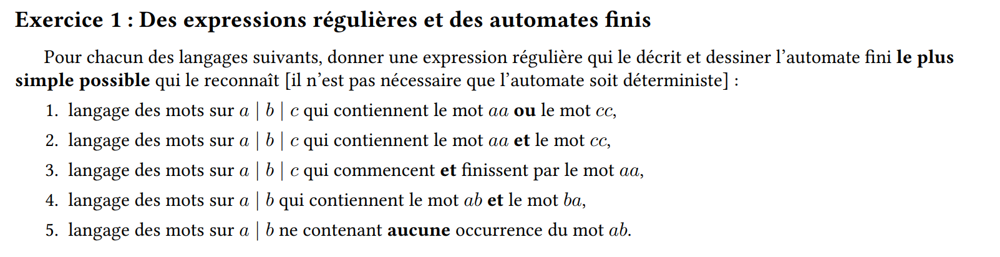
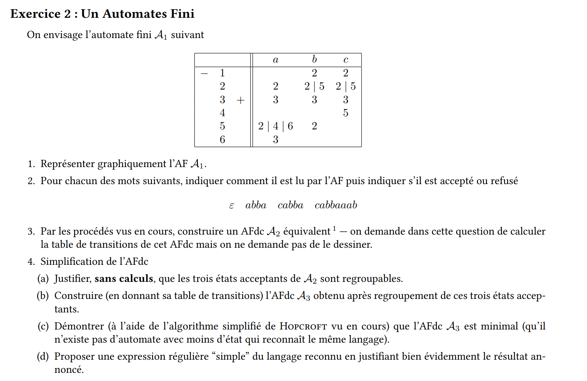

===========================================
Langages des Automates : Correction Final23
===========================================

.. contents::
   :depth: 2
   :local:
   
Exercice 1 : Expressions régulières et automates finis
======================================================

1. Langage des mots sur \( \{a, b, c\} \) contenant "aa" ou "cc"
----------------------------------------------------------------

Expression régulière :
~~~~~~~~~~~~~~~~~~~~~~

Le langage contient des mots qui incluent soit "aa" soit "cc". Une manière de capturer cela est avec l'expression régulière :

.. math::

   (\Sigma^*(aa|\ cc)\Sigma^*)

où \( \Sigma = \{a, b, c\} \).

Automate non-déterministe :
~~~~~~~~~~~~~~~~~~~~~~~~~~~

Cet automate doit détecter "aa" ou "cc" au milieu d’un mot quelconque. Il peut être non-déterministe avec des transitions pour "aa" ou "cc".

.. list-table:: 
   :header-rows: 1

   * - **État**
     - **Symbole \( a \)**
     - **Symbole \( b \)**
     - **Symbole \( c \)**
   * - \( q_0 \)
     - \( q_1 \)
     - \( q_0 \)
     - \( q_2 \)
   * - \( q_1 \)
     - \( q_f \)
     - \( q_0 \)
     - \( q_0 \)
   * - \( q_2 \)
     - \( q_0 \)
     - \( q_0 \)
     - \( q_f \)
   * - \( q_f \)
     - -
     - -
     - -

Explication :
~~~~~~~~~~~~~

L’automate passe de \( q_0 \) à \( q_1 \) lorsqu'il voit un \( a \) et atteint l'état final \( q_f \) après un autre \( a \). Similairement, il passe à \( q_2 \) en voyant \( c \), puis à \( q_f \) en voyant un autre \( c \).

---

2. Langage des mots sur \( \{a, b, c\} \) contenant "aa" et "cc"
----------------------------------------------------------------

Expression régulière :
~~~~~~~~~~~~~~~~~~~~~~

.. math::

   \Sigma^*aa\Sigma^*cc\Sigma^*|\Sigma^*cc\Sigma^*aa\Sigma^*

Automate non-déterministe :
~~~~~~~~~~~~~~~~~~~~~~~~~~~

L’automate peut être construit pour d’abord reconnaître "aa" puis chercher "cc" (ou l'inverse).

.. list-table:: 
   :header-rows: 1

   * - **État**
     - **Symbole \( a \)**
     - **Symbole \( b \)**
     - **Symbole \( c \)**
   * - \( q_0 \)
     - \( q_1 \)
     - \( q_0 \)
     - \( q_3 \)
   * - \( q_1 \)
     - \( q_2 \)
     - \( q_0 \)
     - \( q_0 \)
   * - \( q_2 \)
     - \( q_3 \)
     - \( q_0 \)
     - \( q_3 \)
   * - \( q_3 \)
     - \( q_3 \)
     - \( q_0 \)
     - \( q_f \)
   * - \( q_f \)
     - -
     - -
     - -

Explication :
~~~~~~~~~~~~~

Après avoir trouvé "aa" ou "cc", l’automate continue à rechercher l’autre mot pour arriver à l’état final \( q_f \).

---

3. Langage des mots sur \( \{a, b, c\} \) qui commencent et finissent par "aa"
------------------------------------------------------------------------------

Expression régulière :
~~~~~~~~~~~~~~~~~~~~~~

.. math::

   aa\Sigma^*aa

Automate non-déterministe :
~~~~~~~~~~~~~~~~~~~~~~~~~~~

.. list-table:: 
   :header-rows: 1

   * - **État**
     - **Symbole \( a \)**
     - **Symbole \( b \)**
     - **Symbole \( c \)**
   * - \( q_0 \)
     - \( q_1 \)
     - -
     - -
   * - \( q_1 \)
     - \( q_2 \)
     - -
     - -
   * - \( q_2 \)
     - \( q_2 \)
     - \( q_2 \)
     - \( q_2 \)
   * - \( q_2 \)
     - \( q_3 \)
     - -
     - -
   * - \( q_3 \)
     - \( q_f \)
     - -
     - -

Explication :
~~~~~~~~~~~~~

L’automate vérifie d'abord les deux premiers "a", accepte n'importe quel mot au milieu, et attend que le mot se termine par "aa".

---

4. Langage des mots sur \( \{a, b\} \) contenant "ab" et "ba"
-------------------------------------------------------------

Expression régulière :
~~~~~~~~~~~~~~~~~~~~~~

.. math::

   \Sigma^*ab\Sigma^*ba\Sigma^*|\Sigma^*ba\Sigma^*ab\Sigma^*

Automate non-déterministe :
~~~~~~~~~~~~~~~~~~~~~~~~~~~

.. list-table:: 
   :header-rows: 1

   * - **État**
     - **Symbole \( a \)**
     - **Symbole \( b \)**
   * - \( q_0 \)
     - \( q_1 \)
     - \( q_0 \)
   * - \( q_1 \)
     - \( q_1 \)
     - \( q_2 \)
   * - \( q_2 \)
     - \( q_3 \)
     - \( q_0 \)
   * - \( q_3 \)
     - \( q_f \)
     - \( q_0 \)

Explication :
~~~~~~~~~~~~~

L’automate reconnaît d'abord "ab", puis continue jusqu'à trouver "ba" pour atteindre l'état final.

---

5. Langage des mots sur \( \{a, b\} \) ne contenant aucune occurrence de "ab"
-----------------------------------------------------------------------------

Expression régulière :
~~~~~~~~~~~~~~~~~~~~~~

.. math::

   b^*a^*b^*

Automate non-déterministe :
~~~~~~~~~~~~~~~~~~~~~~~~~~~

.. list-table:: 
   :header-rows: 1

   * - **État**
     - **Symbole \( a \)**
     - **Symbole \( b \)**
   * - \( q_0 \)
     - \( q_0 \)
     - \( q_1 \)
   * - \( q_1 \)
     - -
     - \( q_1 \)

Explication :
~~~~~~~~~~~~~

L’automate reste dans \( q_0 \) tant qu’il n'y a pas de "ab", et va dans un état de rejet si "ab" apparaît.

---

Exercice 2 : Un Automate Fini
=============================

1. Représentation de l'AF \( A_1 \)
-----------------------------------

Voici l'AF \( A_1 \) avec ses transitions décrites :

.. list-table:: 
   :header-rows: 1

   * - **État**
     - **Symbole \( a \)**
     - **Symbole \( b \)**
     - **Symbole \( c \)**
   * - \( 1 \)
     - \( 2 \)
     - \( 2 \)
     - \( 2 \)
   * - \( 2 \)
     - \( 2 \)
     - \( 5 \)
     - \( 2 \)
   * - \( 3 \)
     - \( 3 \)
     - \( 3 \)
     - \( 3 \)
   * - \( 4 \)
     - -
     - -
     - \( 5 \)
   * - \( 5 \)
     - \( 2 \)
     - \( 4 \)
     - \( 6 \)
   * - \( 6 \)
     - \( 3 \)
     - -
     - -

2. Lecture des mots par \( A_1 \)
---------------------------------

- **\( \varepsilon \)** : Mot vide, \( A_1 \) reste dans l'état initial (refusé).
- **abba** : \( A_1 \) passe par les états \( 1 \to 2 \to 5 \to 2 \to 2 \) (refusé).
- **cabba** : \( A_1 \) passe par les états \( 1 \to 2 \to 2 \to 5 \to 2 \to 2 \) (refusé).
- **cabbaaab** : Le mot passe par les états \( 1 \to 2 \to 2 \to 5 \to 2 \to 2 \to 2 \to 2 \to 5 \) (refusé).

3. Construction de l'AFD équivalent \( A_2 \)
---------------------------------------------

Rappel de la table de transition de \( A_1 \) (automate non-déterministe) :

.. list-table:: 
   :header-rows: 1

   * - **État**
     - **Symbole \( a \)**
     - **Symbole \( b \)**
     - **Symbole \( c \)**
   * - \( 1 \)
     - \( 2 \)
     - \( 2 \)
     - \( 2 \)
   * - \( 2 \)
     - \( 2 \)
     - \( 5 \)
     - \( 2 \)
   * - \( 3 \)
     - \( 3 \)
     - \( 3 \)
     - \( 3 \)
   * - \( 4 \)
     - -
     - -
     - \( 5 \)
   * - \( 5 \)
     - \( 2 \)
     - \( 4 \)
     - \( 6 \)
   * - \( 6 \)
     - \( 3 \)
     - -
     - -

Pour transformer cet AFND en AFD, nous devons construire l'automate des sous-ensembles. Cela signifie que nous devons considérer les ensembles d'états qui peuvent être atteints à chaque étape, en combinant les transitions non-déterministes.

Table de transition de l'AFD \( A_2 \) obtenu par déterminisation :

.. list-table:: 
   :header-rows: 1

   * - **États combinés**
     - **Symbole \( a \)**
     - **Symbole \( b \)**
     - **Symbole \( c \)**
   * - \( \{1\} \)
     - \( \{2\} \)
     - \( \{2\} \)
     - \( \{2\} \)
   * - \( \{2\} \)
     - \( \{2\} \)
     - \( \{5\} \)
     - \( \{2\} \)
   * - \( \{5\} \)
     - \( \{2\} \)
     - \( \{4\} \)
     - \( \{6\} \)
   * - \( \{4\} \)
     - -
     - -
     - \( \{5\} \)
   * - \( \{6\} \)
     - \( \{3\} \)
     - -
     - -
   * - \( \{3\} \)
     - \( \{3\} \)
     - \( \{3\} \)
     - \( \{3\} \)
   * - \( \{2, 5\} \)
     - \( \{2\} \)
     - \( \{4, 5\} \)
     - \( \{2, 6\} \)
   * - \( \{4, 5\} \)
     - \( \{2\} \)
     - \( \{4\} \)
     - \( \{5, 6\} \)
   * - \( \{5, 6\} \)
     - \( \{2, 3\} \)
     - \( \{4\} \)
     - \( \{6\} \)

Explication :
~~~~~~~~~~~~~

Chaque ligne de cette table représente un ensemble d'états possibles après avoir lu un symbole donné. Par exemple, \( \{2, 5\} \) indique que l'automate peut être dans l'état 2 ou 5 après avoir lu un certain nombre de symboles.

---

4. Simplification de l'AFD
--------------------------

a) Justification que les trois états acceptants de \( A_2 \) sont regroupables
~~~~~~~~~~~~~~~~~~~~~~~~~~~~~~~~~~~~~~~~~~~~~~~~~~~~~~~~~~~~~~~~~~~~~~~~~~~~~~

Les trois états acceptants \( \{3, 5, 6\} \) peuvent être regroupés parce qu'ils mènent tous à des transitions similaires et n'ont aucune distinction nécessaire dans les transitions pour reconnaître le langage. Ils ont donc des comportements équivalents vis-à-vis des autres états.

b) Table de transitions de l'AFD simplifié \( A_3 \)
~~~~~~~~~~~~~~~~~~~~~~~~~~~~~~~~~~~~~~~~~~~~~~~~~~~~~

Après avoir regroupé les états \( \{3, 5, 6\} \) en un seul état \( q_f \), nous obtenons une nouvelle table de transition simplifiée.

.. list-table:: 
   :header-rows: 1

   * - **États combinés**
     - **Symbole \( a \)**
     - **Symbole \( b \)**
     - **Symbole \( c \)**
   * - \( \{1\} \)
     - \( \{2\} \)
     - \( \{2\} \)
     - \( \{2\} \)
   * - \( \{2\} \)
     - \( \{2\} \)
     - \( \{5\} \)
     - \( \{2\} \)
   * - \( \{5\} \)
     - \( \{2\} \)
     - \( \{4\} \)
     - \( q_f \)
   * - \( \{4\} \)
     - -
     - -
     - \( \{5\} \)
   * - \( q_f \)
     - \( q_f \)
     - \( q_f \)
     - \( q_f \)

Explication :
~~~~~~~~~~~~~

Les états \( 3, 5, 6 \) ont été regroupés en un seul état final \( q_f \), car ils ont des transitions équivalentes.

c) Preuve de la minimalité de \( A_3 \) (Algorithme de Hopcroft simplifié)
~~~~~~~~~~~~~~~~~~~~~~~~~~~~~~~~~~~~~~~~~~~~~~~~~~~~~~~~~~~~~~~~~~~~~~~~~~

1. **Étape 1** : Partition initiale — Nous commençons par deux ensembles : les états acceptants \( \{q_f\} \) et les non-acceptants \( \{1, 2, 4\} \).
2. **Étape 2** : Distinction des états — Nous vérifions les transitions depuis ces états. Les états \( 1, 2 \) sont distinguables par leurs transitions, mais les états \( 4 \) et \( q_f \) sont bien distincts des autres.
3. **Étape 3** : Finalisation — Après avoir itéré sur les transitions, nous concluons que \( A_3 \) est minimal car il n'existe aucune autre fusion possible d'états sans modifier le langage reconnu.

d) Expression régulière du langage reconnu
~~~~~~~~~~~~~~~~~~~~~~~~~~~~~~~~~~~~~~~~~~

L’expression régulière du langage reconnu par l'automate \( A_3 \) peut être simplifiée comme :

.. math::

   (a | b | c)^*(ab|c)^*(ba|c)^*(a | b | c)^*

Explication :
~~~~~~~~~~~~~

Cette expression régulière représente tous les mots formés à partir de \( \{a, b, c\} \) contenant les motifs "ab" ou "ba" dans différentes positions.
