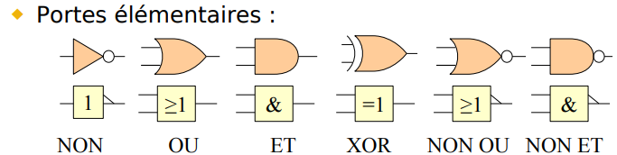
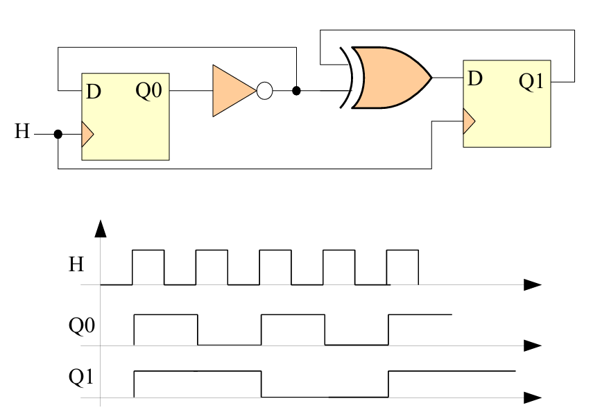

=================
Mémoires Binaires
=================

.. contents::
   :depth: 2
   :local:

Portes élémentaires
===================

- **NON** : Inverse le signal d'entrée.

- **OU** : Sortie vraie si au moins une entrée est vraie.

- **ET** : Sortie vraie si toutes les entrées sont vraies.

- **XOR** : Sortie vraie si une seule des entrées est vraie.

- **NON OU** : Inverse la sortie de l'OU.

- **NON ET** : Inverse la sortie de l'ET.

Méthodologie pour compléter un chronogramme
~~~~~~~~~~~~~~~~~~~~~~~~~~~~~~~~~~~~~~~~~~~

1. **Identifier les composants** : Bascule D, portes logiques, etc.
   
2. **Suivre les fronts d'horloge** : Les bascules changent d'état uniquement sur les fronts (montants ou descendants).

3. **Observer les entrées** : Au front actif de l'horloge, la sortie \( Q \) de la bascule prend la valeur de l'entrée \( D \).

4. **Appliquer les portes logiques** : Utiliser les résultats des bascules et appliquer les règles des portes logiques (AND, OR, NOT) pour calculer les autres signaux.

5. **Valider** : Vérifier que chaque signal évolue en cohérence avec les composants et l'horloge.

2.1 Bascule D avec commandes de chargement et remise à zéro
~~~~~~~~~~~~~~~~~~~~~~~~~~~~~~~~~~~~~~~~~~~~~~~~~~~~~~~~~~~

On souhaite concevoir une mémoire 1 bit synchrone à l'aide d'une bascule D avec les entrées suivantes :
- **Data** : entrée de donnée
- **Clk** : entrée d'horloge
- **nLoad** : commande de chargement (active à l'état bas)
- **nReset** : commande de remise à zéro (active à l'état bas, prioritaire sur nLoad)

Table de vérité de l'entrée D de la bascule
~~~~~~~~~~~~~~~~~~~~~~~~~~~~~~~~~~~~~~~~~~~

La table de vérité doit tenir compte de la priorité de la commande **nReset** sur **nLoad**. Voici les différents états possibles :

.. list-table:: 
   :header-rows: 1

   * - **nReset**
     - **nLoad**
     - **Data**
     - **D (entrée de la bascule)**
   * - 0
     - X
     - X
     - 0
   * - 1
     - 0
     - 0
     - 0
   * - 1
     - 0
     - 1
     - 1
   * - 1
     - 1
     - X
     - Q (valeur actuelle)

Équation logique pour D
~~~~~~~~~~~~~~~~~~~~~~~

Pour définir l'équation de l'entrée D en fonction des commandes et de la donnée, on peut procéder comme suit :

- Lorsque **nReset = 0**, la sortie est toujours 0 (peu importe les autres entrées).
- Lorsque **nReset = 1** et **nLoad = 0**, D prend la valeur de **Data**.
- Lorsque **nReset = 1** et **nLoad = 1**, la sortie reste à la valeur actuelle \( Q \).

L'équation logique de \( D \) est donc :

.. math::

   D = \overline{nReset} \cdot 0 + nReset \cdot \left( \overline{nLoad} \cdot Data + nLoad \cdot Q \right)

Simplifiée, cette équation devient :

.. math::

   D = \overline{nReset} + nReset \cdot (\overline{nLoad} \cdot Data + nLoad \cdot Q)

Cette équation indique que si **nReset** est actif (0), la sortie est remise à zéro. Sinon, la sortie dépend de **nLoad** et **Data**.

---

2.2 Compteur synchrone mod 7
~~~~~~~~~~~~~~~~~~~~~~~~~~~~

Un compteur modulo 7 compte les états de 0 à 6. Le compteur se réinitialise à 0 après avoir atteint 6. Nous devons déterminer les équations logiques pour les entrées \( D_2, D_1, D_0 \) en fonction des sorties \( Q_2, Q_1, Q_0 \).

Table des états du compteur mod 7
~~~~~~~~~~~~~~~~~~~~~~~~~~~~~~~~~

Le compteur mod 7 compte de 0 à 6, soit 7 états en binaire sur 3 bits.

.. list-table:: 
   :header-rows: 1

   * - **État**
     - **Q2**
     - **Q1**
     - **Q0**
     - **Nouvel état (Q')**
     - **D2**
     - **D1**
     - **D0**
   * - 0
     - 0
     - 0
     - 0
     - 1
     - 0
     - 0
     - 1
   * - 1
     - 0
     - 0
     - 1
     - 2
     - 0
     - 1
     - 0
   * - 2
     - 0
     - 1
     - 0
     - 3
     - 0
     - 1
     - 1
   * - 3
     - 0
     - 1
     - 1
     - 4
     - 1
     - 0
     - 0
   * - 4
     - 1
     - 0
     - 0
     - 5
     - 1
     - 0
     - 1
   * - 5
     - 1
     - 0
     - 1
     - 6
     - 1
     - 1
     - 0
   * - 6
     - 1
     - 1
     - 0
     - 0
     - 0
     - 0
     - 0

Calcul des équations logiques pour D2, D1, D0
~~~~~~~~~~~~~~~~~~~~~~~~~~~~~~~~~~~~~~~~~~~~~

- **Équation pour \( D_0 \)** :
  \( D_0 \) change d'état à chaque front d'horloge, c'est donc une bascule Toggle (T). \( D_0 \) est donc inversé à chaque cycle.
  
  L'équation logique est :
  
  .. math::
  
     D_0 = \overline{Q_0}

- **Équation pour \( D_1 \)** :
  \( D_1 \) change d'état chaque fois que \( Q_0 = 1 \) (soit à chaque fois que l'état est impair).

  L'équation logique est :
  
  .. math::
  
     D_1 = Q_0 \oplus Q_1

- **Équation pour \( D_2 \)** :
  \( D_2 \) change d'état chaque fois que l'état passe de 3 à 4 (quand \( Q_1 \) et \( Q_0 \) sont tous les deux à 1).

  L'équation logique est :
  
  .. math::
  
     D_2 = Q_2 \oplus (Q_1 \cdot Q_0)

Ces équations permettent de réaliser un compteur mod 7 qui compte les états de 0 à 6 et revient à 0 après avoir atteint 6.

---

Fonctionnement du registre universel 8 bits
-------------------------------------------

Pour ce registre universel 8 bits, chaque bit est mémorisé dans une bascule D, et les deux entrées de commande \( S_1 \) et \( S_0 \) définissent le mode de fonctionnement du registre.

Fonctionnement du registre
~~~~~~~~~~~~~~~~~~~~~~~~~~

- **\( S_1S_0 = 00 \)** : Maintien de la valeur mémorisée (\( Q_0 \)).
- **\( S_1S_0 = 01 \)** : Décalage à gauche synchrone, \( Q_0 \) devient \( Q_1 \), et on utilise l'entrée série gauche \( EG \).
- **\( S_1S_0 = 10 \)** : Décalage à droite synchrone, \( Q_0 \) reçoit \( Q_1 \), et on utilise l'entrée série droite \( ED \).
- **\( S_1S_0 = 11 \)** : Charge la valeur des entrées parallèles \( E_7 \dots E_0 \).

Équation logique de l'entrée \( D_0 \) de la bascule D (bit de poids faible)
~~~~~~~~~~~~~~~~~~~~~~~~~~~~~~~~~~~~~~~~~~~~~~~~~~~~~~~~~~~~~~~~~~~~~~~~~~~~

Le comportement de la bascule D0 dépend des commandes \( S_1 \) et \( S_0 \), ce qui peut être décrit par une équation conditionnelle combinant les modes de fonctionnement :

1. **Mode 00 : maintien de la valeur mémorisée**  
   - \( D_0 = Q_0 \)
   
2. **Mode 01 : décalage à gauche**  
   - \( D_0 = Q_1 \) (le bit \( Q_1 \) se déplace vers \( Q_0 \), et le bit le plus significatif \( E_7 \) est en entrée série gauche \( EG \))
   
3. **Mode 10 : décalage à droite**  
   - \( D_0 = ED \) (on utilise l'entrée série droite \( ED \))

4. **Mode 11 : chargement de la nouvelle valeur**  
   - \( D_0 = E_0 \) (on charge la nouvelle valeur sur \( E_0 \))

Équation combinée pour \( D_0 \)
~~~~~~~~~~~~~~~~~~~~~~~~~~~~~~~~

L'équation logique de \( D_0 \) en fonction de \( S_1 \), \( S_0 \), \( Q_0 \), \( Q_1 \), \( ED \), et \( E_0 \) peut être écrite comme suit :

.. math::

   D_0 = \overline{S_1} \cdot \overline{S_0} \cdot Q_0 + \overline{S_1} \cdot S_0 \cdot Q_1 + S_1 \cdot \overline{S_0} \cdot ED + S_1 \cdot S_0 \cdot E_0