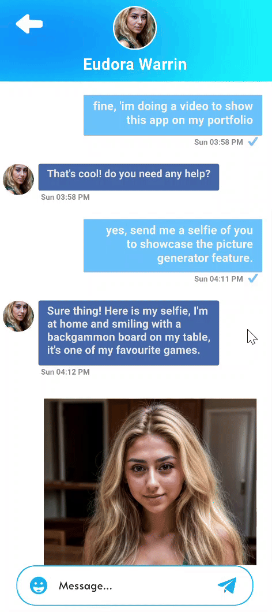
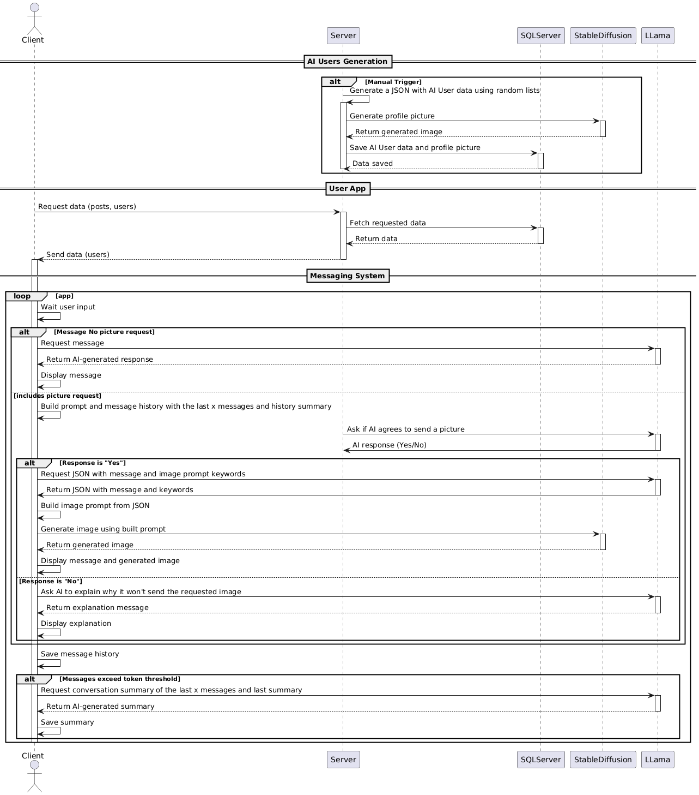

# Aissenger: The Chatbot That Remembers

## Overview
Aissenger is an intelligent chatbot designed to overcome the common "memory loss" problem in long conversations. Inspired by user frustrations with existing platforms that forget context due to token limitations, I built a system that intelligently summarizes and retains key conversational details, ensuring a more coherent and human-like interaction.

## Key Features
- **Intelligent Memory Management**: Summarizes conversations on-the-fly to retain crucial context, effectively overcoming API token limits.
- **Dynamic AI Personalities**: Each AI character is crafted with unique traits and a backstory, leading to distinct and engaging conversational styles.
- **On-the-Fly Image Generation**: Detects picture requests within the chat using **REGEX** and generates an image in parallel with the text response, creating a rich multimedia experience.

## Demos in Action

<!-- grid-2 -->

    <video src="../img/projects/aissenger/demo_match_personnality.mp4" controls loop style="width: 48%; border-radius: 8px;"></video>
    <video src="../img/projects/aissenger/demo_chat.mp4" controls loop style="width: 48%; border-radius: 8px;"></video>

<!-- end-grid -->
*Left: Selecting an AI. Right: Chatting with an AI that has its own personality.*

### Feature Spotlight: Smart Image Requests
I implemented a REGEX-based system to detect when a user asks for a picture. This triggers a separate image generation process that runs alongside the standard text reply.

    

## System Architecture
To achieve low latency for both text and image responses, I designed a system that processes requests in parallel. The diagram below illustrates the flow from user input to receiving a dual text and image response.

## Development Challenges
- **Optimizing Response Time**: The primary challenge was processing both a text response (from one API) and an image generation request (from another) simultaneously without creating a noticeable delay for the user. This required careful management of asynchronous operations.

## Lessons Learned & Future Scope
> This project was a deep dive into managing asynchronous API calls and the practical application of REGEX for complex string detection. It highlighted the importance of parallel processing for building a responsive user experience.

As a rapid personal project, it was built with a client-side focus. Future improvements would include:
- **Backend Refactor**: Implementing a dedicated server manager to handle API keys and requests more securely and efficiently.
- **Data Persistence**: Integrating a database for persistent, server-side storage of conversations and user data.