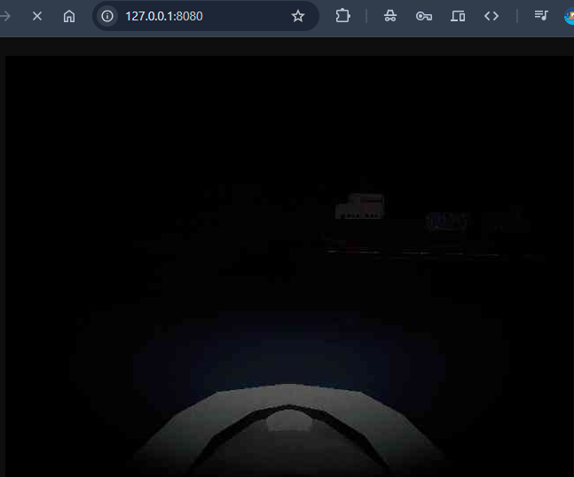
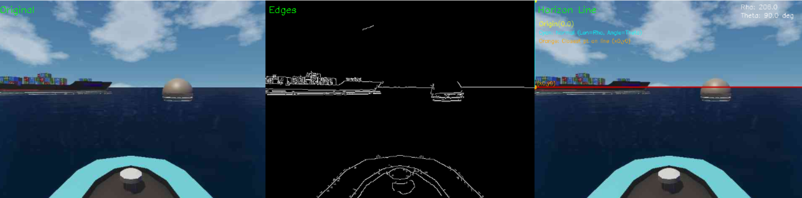
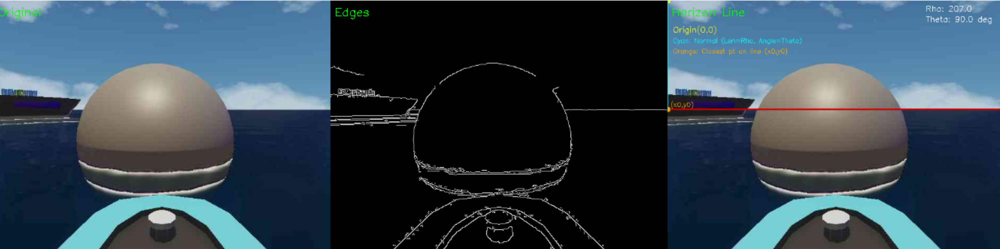
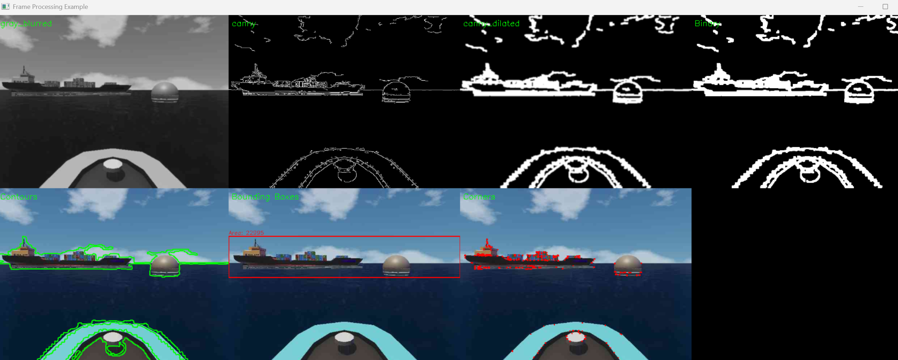

# Autonomous Boat: Computer Vision from Scratch

## Overview
To truly understand the mechanics of computer vision, I challenged myself to build an obstacle detection system from the ground up, intentionally avoiding high-level libraries like YOLO. This project focuses on the *process* and the *mathematics* behind CV algorithms.

To do this, I created a custom pipeline:
1.  A **Unity simulation** of a boat on the water, featuring a dynamic day/night cycle and a deliberately low-quality camera feed.
2.  The camera feed is **streamed to a local web page**.
3.  A **Python script** processes the video stream in real-time to detect and analyze the environment.

<!-- grid-2 -->

    

        <video src="../img/projects/autonomousboat/localhost.mp4" controls loop autoplay muted style="width: 100%; border-radius: 8px;"></video>
        
Live stream from Unity

    

    

        
        
Night simulation with light source

    

<!-- end-grid -->

## Stage 1: Horizon Line Detection
The first fundamental step was to establish a stable reference point by detecting the horizon. I implemented this by combining two classic CV algorithms:

- **Canny Edge Detection**: To identify all potential edges in the frame.
- **Hough Transform**: To analyze the edges and specifically isolate the most prominent straight line, which corresponds to the horizon.

I also added a smoothing algorithm to the line's position to prevent it from jittering due to waves, ensuring a stable detection even with obstacles in view.

    
    
    <video src="../img/projects/autonomousboat/houghline.mp4" controls loop autoplay muted style="max-width: 600px; width: 100%; border-radius: 8px;"></video>

## Stage 2: Obstacle Detection with Contours
My initial approach to identifying obstacles was to use contour detection. This multi-step process demonstrates a foundational filtering pipeline:

1.  **Grayscale Conversion**: Reduced the image from 3 channels (RGB) to 1, simplifying processing.
2.  **Canny Edge Detection**: To find the outlines of all objects.
3.  **Dilatation**: Thickened the detected edges to ensure complete object outlines.
4.  **Binary Thresholding**: Converted the image to pure black and white to isolate contours.
5.  **Contour Finding**: Used OpenCV's algorithm to identify distinct shapes.
6.  **Bounding Box Generation**: Drew a box around each detected contour to define a Region of Interest (ROI).

### The Challenge
> This method revealed a critical flaw: the horizon line was often detected as part of an obstacle's contour, causing the bounding boxes to merge incorrectly. This demonstrated that a more sophisticated feature detection method was needed.

## Lessons Learned & Next Steps (WIP)
This project has been an invaluable exercise in applying CV theory. The failure of the initial contour method was a key learning moment, highlighting the need for more robust feature identifiers that aren't dependent on continuous lines.

My next focus is on **Harris Corner Detection** to identify unique points on obstacles, which should be more resilient. The roadmap includes:
- **Clustering**: Grouping detected corners to form accurate bounding boxes.
- **Object Classification**: Implementing algorithms from basic **KNN** to simple neural networks to differentiate between boats, islands, and other objects.
- **Object Localization**: Building the logic to map and avoid obstacles, completing the autonomous navigation loop.