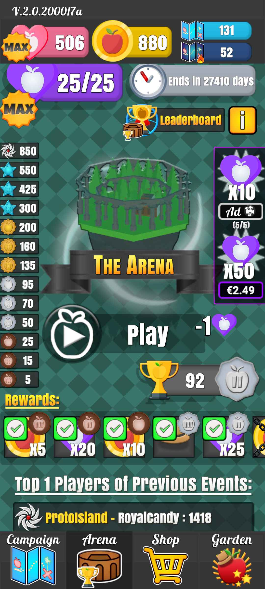
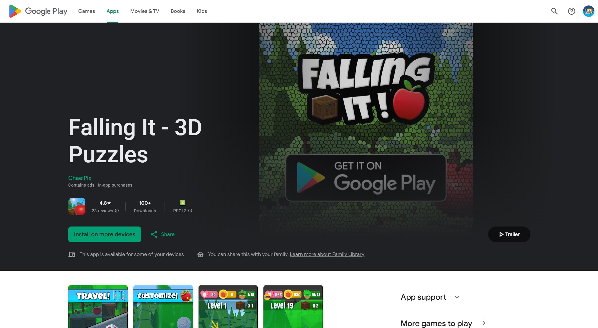
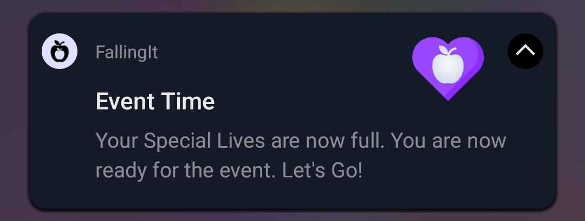
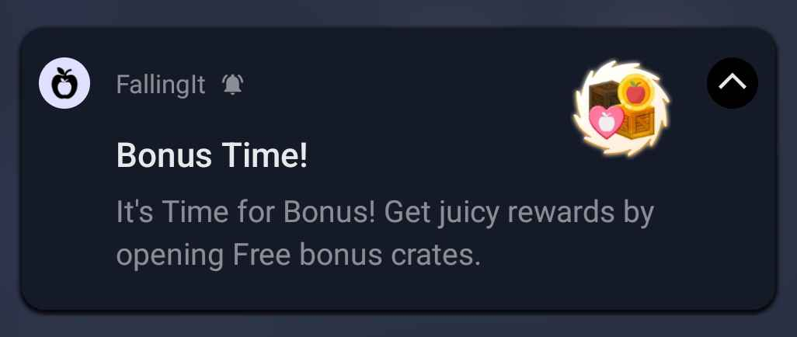
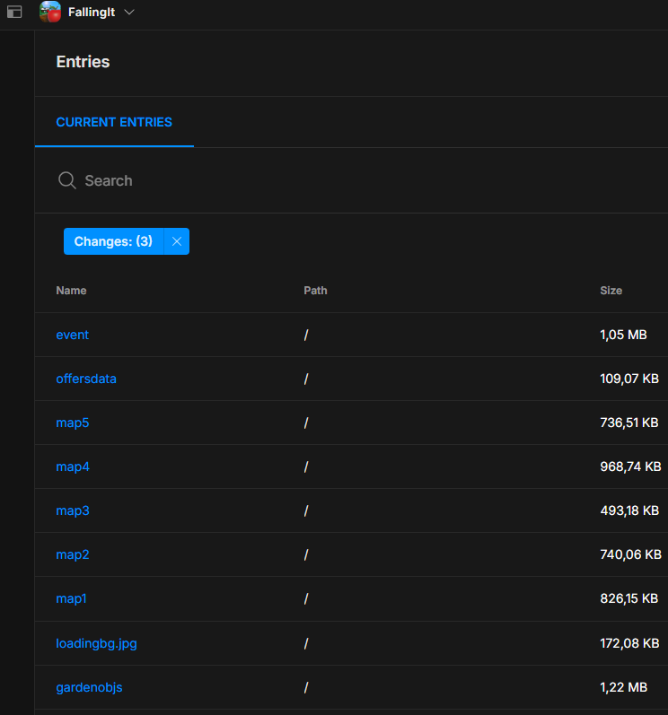

# Falling It: From Concept to Google Play

## Overview
After gaining experience in Unity, I set myself the challenge of mastering the entire mobile game development lifecycle. The result is *Falling It*, a casual 3D physics-based puzzle game I developed from scratch and successfully published on the Google Play Store. The core gameplay requires players to strategically interact with the environment to make an apple fall to the ground.

## Key Features
- **Full Development Lifecycle**: Managed the entire project pipeline, from initial concept and game design to final publication and post-launch support.
- **Strategic 3D Physics Gameplay**: Core mechanics built around Unity's physics engine, creating engaging and challenging puzzles.
- **Google Play Services Integration**: Implemented **Cloud Save** for seamless progress synchronization and **Leaderboards** to foster competition.
- **Monetization with In-App Purchases (IAP)**: Integrated a full IAP system for non-intrusive monetization.
- **Dynamic Content Delivery**: Used **Unity Asset Bundles** and **Unity Cloud** to deliver new maps and events without requiring app updates.
- **Player Engagement**: Implemented **Push Notifications** and time-limited events with special rewards to keep players coming back.
- **Customization & Collectibles**: Players can unlock and collect cosmetic items to personalize their character and garden area.

## Gameplay & Features in Action

<!-- grid-2 -->

    

        <video src="../img/projects/fallingit/fit_gameplay.mp4" controls loop style="width: 100%; border-radius: 8px; border: 2px solid #333;"></video>
        
Core Physics Puzzle Gameplay

    

    

        <video src="../img/projects/fallingit/fit_garden.mp4" controls loop style="width: 100%; border-radius: 8px; border: 2px solid #333;"></video>
        
Customizing the Apple & Garden

    

<!-- end-grid -->

    

Event page with special features

## Technical Deep Dive: Key Integrations

This project was a fantastic opportunity to work with critical mobile gaming technologies beyond the game engine itself.

### Publishing to the Google Play Store
This was my first time publishing an app. The process involved learning to properly sign an application, manage Android Studio dependencies, and navigate the Google Play Console's requirements.

    

<a href="https://play.google.com/store/apps/details?id=com.ChaelPixCorp.FallingIt&hl=en" target="_blank">View Falling It on the Play Store</a>

### Google Play Games, IAP & Push Notifications

<!-- grid-3 -->

    <video src="../img/projects/fallingit/fit_loading.mp4" controls loop style="width: 30%; border-radius: 8px; border: 2px solid #333;"></video>
    <video src="../img/projects/fallingit/fit_leaderboard.mp4" controls loop style="width: 30%; border-radius: 8px; border: 2px solid #333;"></video>
    <video src="../img/projects/fallingit/fit_shop.mp4" controls loop style="width: 30%; border-radius: 8px; border: 2px solid #333;"></video>

<!-- end-grid -->

Left to Right: Google Play Sign-In & Cloud Save, Leaderboards, In-App Purchase Shop.

<!-- grid-2 -->

    
    

<!-- end-grid -->

Push notifications to re-engage players.

### Dynamic Content with Asset Bundles
To keep the game fresh, I used **Unity Cloud** to host and deliver asset bundles. This allows me to add new maps, events, and items dynamically without forcing players to download a new version of the app from the Play Store.

<!-- grid-2 -->

    <video src="../img/projects/fallingit/fit_maps.mp4" controls loop style="width: 48%; border-radius: 8px; border: 2px solid #333;"></video>
    

<!-- end-grid -->

Left: Maps loading dynamically from the cloud. Right: Asset bundles configured in Unity Cloud.

## Lessons Learned
> This project was an invaluable crash course in the entire mobile gaming ecosystem. It taught me that a successful game is as much about its underlying infrastructure, publishing process, and live-ops strategy as it is about the core gameplay. Mastering asset bundles and cloud services was a highlight, as it unlocks the ability to create truly dynamic and evolving game experiences.