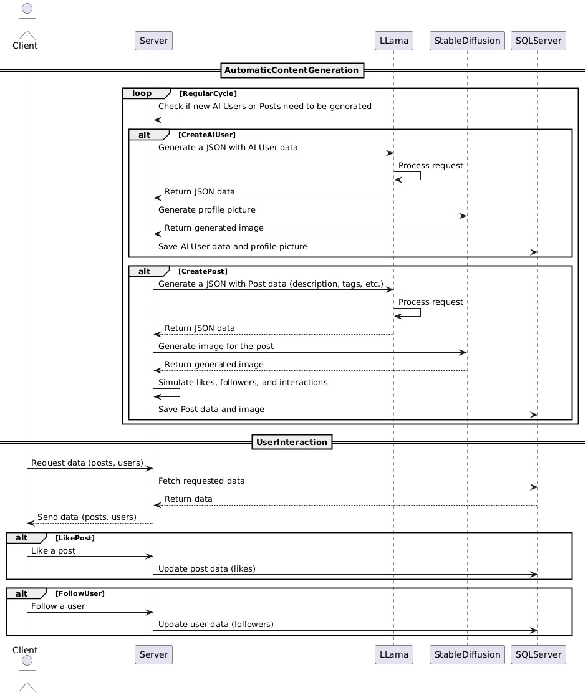

# IAStagram: An Autonomous AI Social Media Simulator

## Overview
To dive deep into the world of generative AI, I developed IAStagram: a fully autonomous application that simulates a social media platform. The system perpetually creates its own content—from AI-generated users with unique personalities to the posts they share—all powered by **Llama** and **Stable Diffusion** running on a self-hosted server.

## Live Demo
Watch the platform come to life as it automatically generates and displays new content.

    <video src="../img/projects/iastagram/iastagram.mp4" controls loop style="width: 80%; max-width: 300px; border-radius: 8px;"></video>

## Key Features
- **Autonomous Content Engine**: The system runs a continuous loop to generate new AI users and posts, creating an ever-evolving social feed without any human input.
- **AI-Powered Text Generation**: Leverages a **Llama 8B** model to create detailed user profiles, post descriptions, and relevant tags.
- **AI-Generated Visuals**: Uses a **Stable Diffusion 1.5** model to generate unique profile pictures for each AI user and compelling images for their posts.
- **Full-Stack System**: A complete client-server architecture with a **SQL database** to store all generated data and manage user interactions like "likes" and "follows".

## System Architecture
The application is built on a robust, event-driven architecture that separates content generation from user interaction. The server orchestrates calls to the Llama and Stable Diffusion models for content creation and manages the SQL database for persistence.

This sequence diagram illustrates the complete data flow:

## The Technical Challenge: Resource Optimization
A significant challenge was deploying and running these models on my personal Linux machine, which is equipped with a modest **GTX 1060 laptop GPU**.

To solve this, I:
1.  **Selected Optimized Models**: I chose the efficient **Llama 8B** and a fine-tuned **Stable Diffusion 1.5 Hyper** model to balance performance with resource consumption.
2.  **Dedicated AI Server**: I configured the Linux machine as a dedicated AI inference server, ensuring all GPU resources were available for the models.
3.  **Asynchronous Processing**: The system was designed to handle generation tasks in the background, preventing the UI from freezing and ensuring a smooth user experience.

## Technology Stack
| Area | Technology | Purpose |
|---|---|---|
| **Text Generation** | Llama 8B | Creating user bios, post captions, and tags. |
| **Image Generation** | Stable Diffusion 1.5 | Generating profile pictures and post images. |
| **Backend** | Custom Server | Orchestrating AI model calls and managing data. |
| **Database** | SQL Server | Storing all user, post, and interaction data. |
| **Hosting** | Self-Hosted Linux Server| Running the entire backend and AI model stack. |