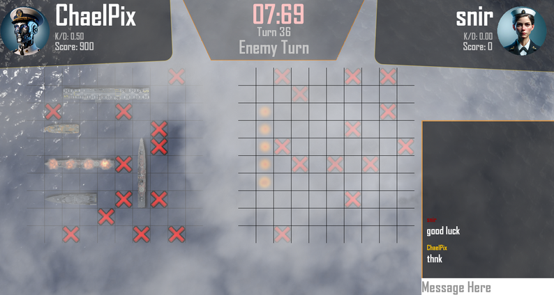
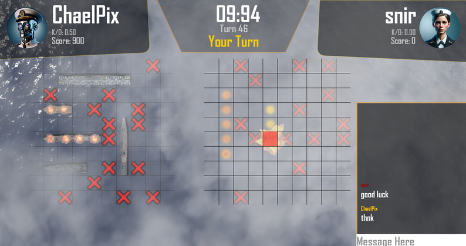
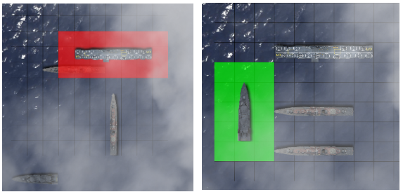
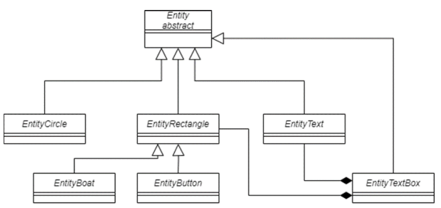
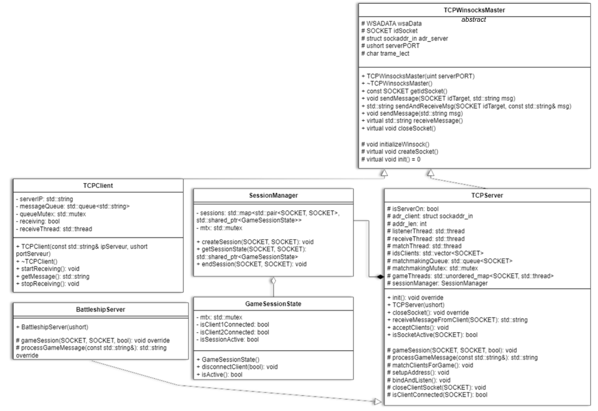
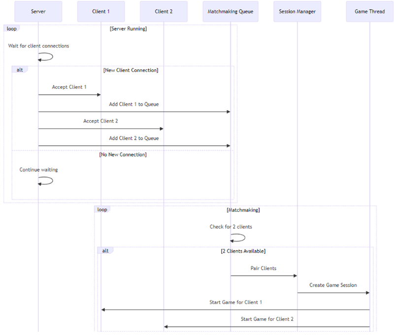

# Valiant: Multiplayer Battleship in C++

## Overview
As a three-week school project, my teammate and I were tasked with creating a multiplayer battleship game from scratch in C++. We decided to push the boundaries of the assignment, delivering a polished game complete with a custom graphical interface, a multi-threaded TCP server for matchmaking, persistent online stats, and in-game chat.

**My primary contributions were architecting and implementing the entire networking stack and the SFML-based graphics engine.**

## Links & Resources
- **[Download and Play on Itch.io](https://chaelpix.itch.io/valiant)**

## Gameplay Demo
See the full game in action, from the menu to multiplayer combat.

    <iframe src="https://www.youtube.com/embed/ImCbqGZR-jY" frameborder="0" allow="accelerometer; autoplay; clipboard-write; encrypted-media; gyroscope; picture-in-picture" allowfullscreen style="position: absolute; top: 0; left: 0; width: 100%; height: 100%;"></iframe>

## Screenshots

<!-- grid-3 -->

    
    
    

<!-- end-grid -->

## Technical Deep Dive: My Contributions

### 1. Custom UI Engine with SFML
The game's graphical interface was built using **SFML**, a low-level C++ library that only provides basic rendering primitives (shapes, text). To build a scalable and manageable UI, I designed and implemented my own class-based framework on top of it. This custom engine handled complex elements like buttons, layouts, and screen transitions, which significantly streamlined the development process.

*Simplified class diagram of my custom UI framework. (Click to view full size)*

### 2. Multi-threaded Networking & Matchmaking
I developed the complete networking system using **C++ and Winsock**. The backbone is a multi-threaded TCP server I built to manage concurrent client connections. This architecture was crucial for implementing a seamless matchmaking system where players can join a lobby, get queued, and be automatically paired with an opponent to start a game.

The diagrams below illustrate the architecture of the networking stack and the logic of the matchmaking sequence.

*Class diagram of the networking stack. (Click to view full size)*

*Sequence diagram of the matchmaking system. (Click to view full size)*

## Lessons Learned
> This project was an intense but rewarding deep dive into low-level C++ development. Building a UI framework and a multi-threaded server from scratch under a tight deadline taught me invaluable lessons in software architecture, asynchronous programming, and effective project management.