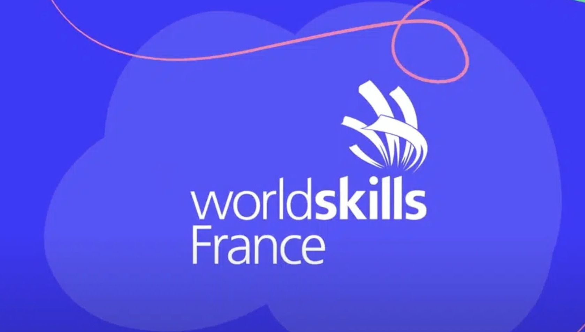
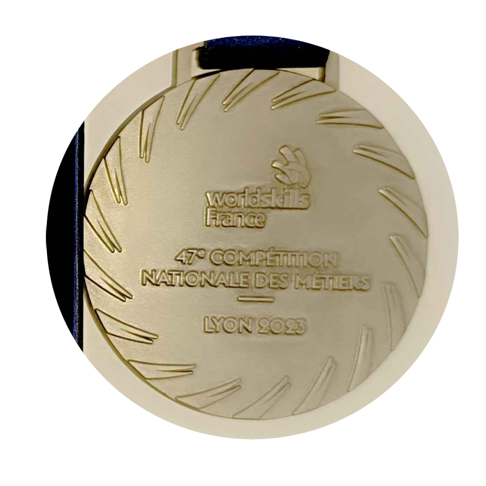
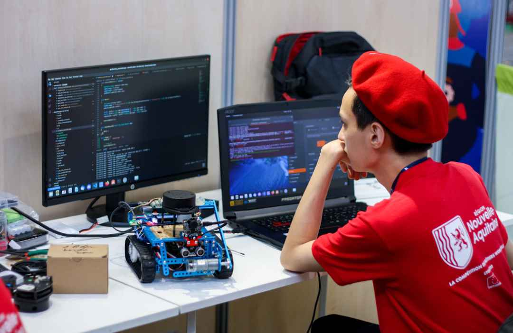
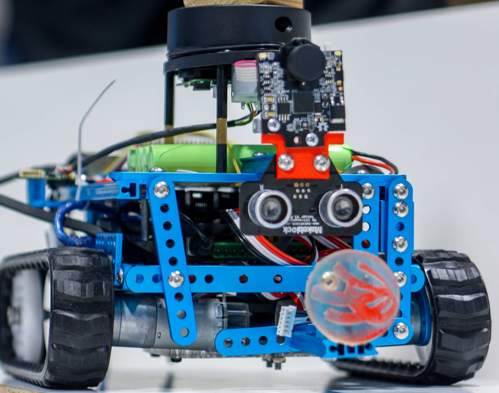

# WorldSkills France 2023: National Finals

<!-- grid-2 -->

    
    

<!-- end-grid -->

## The Challenge: Upping the Ante with ROS
After my regional success, I advanced to the 4-day national finals. I secured the **Silver Medal**, a fantastic achievement where the software and systems I developed performed exceptionally. This competition marked my transition to a much more complex and powerful robotics framework.

## Technical Achievements
I leveled up the robot's capabilities by building a system on **ROS1 Noetic** and **C++**, using a Raspberry Pi for processing and an Arduino for low-level motor control.

- **Lidar-Based Mapping and Navigation (SLAM):** I implemented the `hector_slam` package, allowing the robot to use a Lidar to build a map of its environment in real-time and navigate autonomously. This is a significant step up from simple sensor-based navigation.
- **Computer Vision for Task Execution:** I integrated a camera with **OpenCV** to detect and read QR codes. This allowed the robot to receive dynamic instructions from the environment and react accordingly, demonstrating a fusion of perception and action.

### Gallery
<!-- grid-2 -->

    
    

<!-- end-grid -->