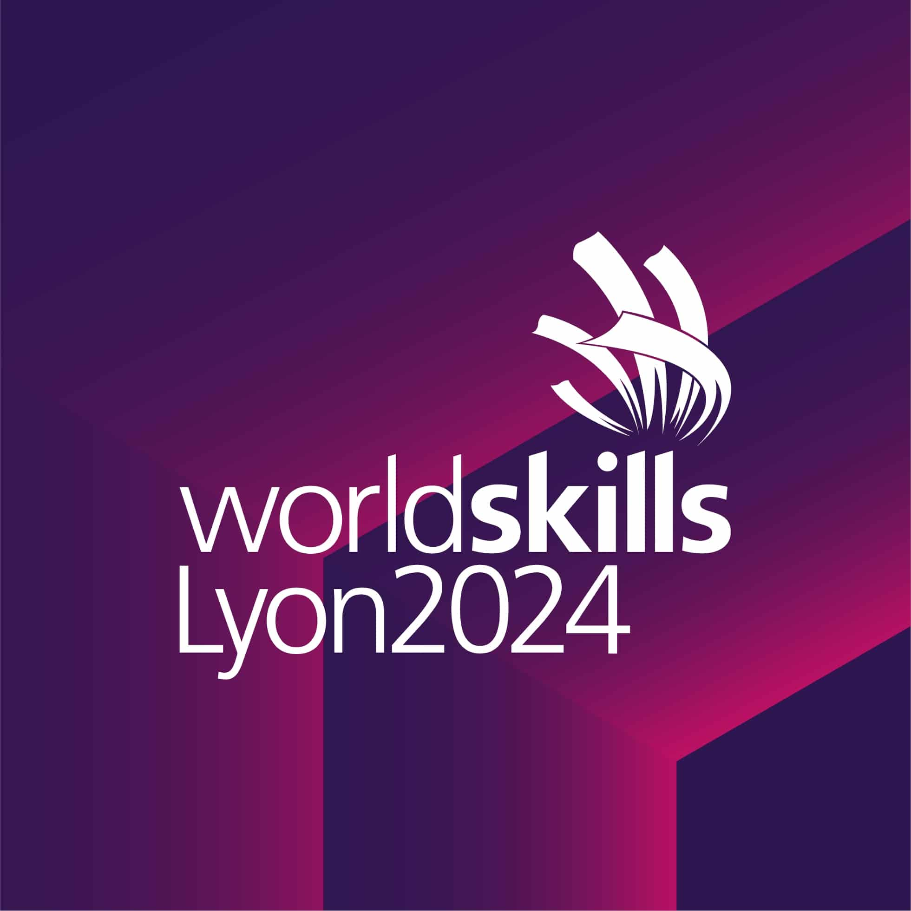
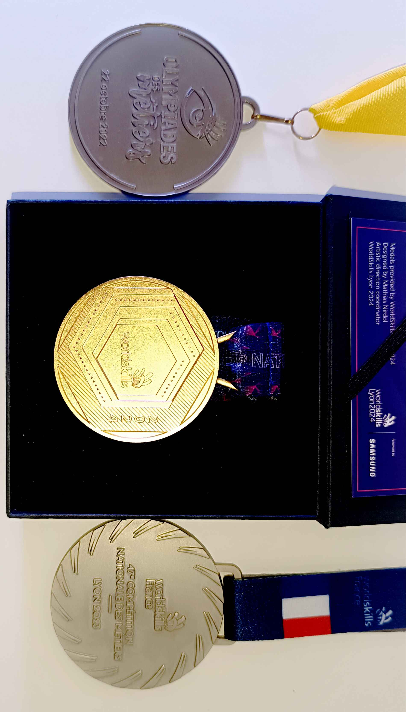
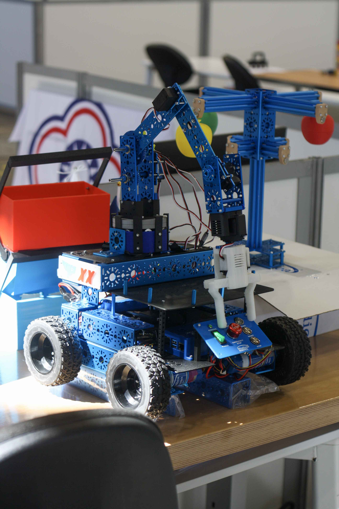
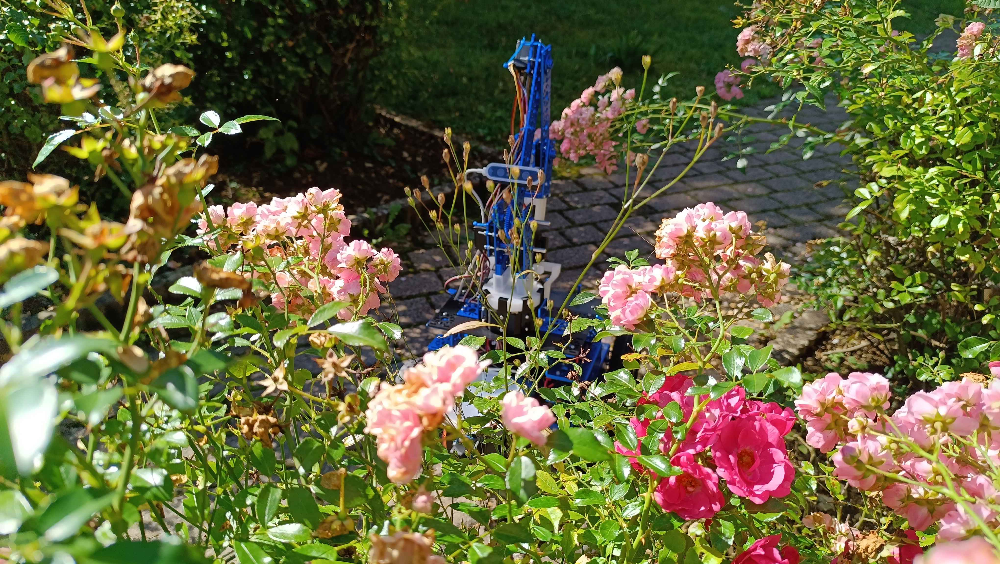
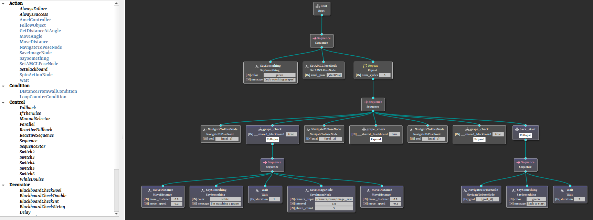
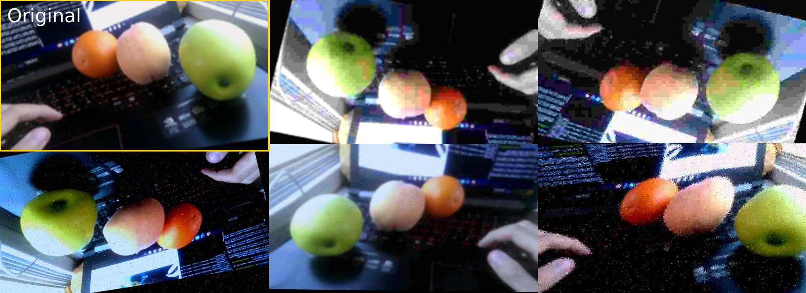
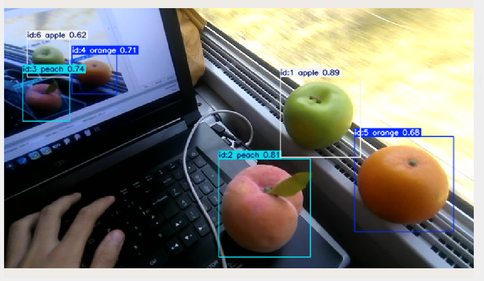
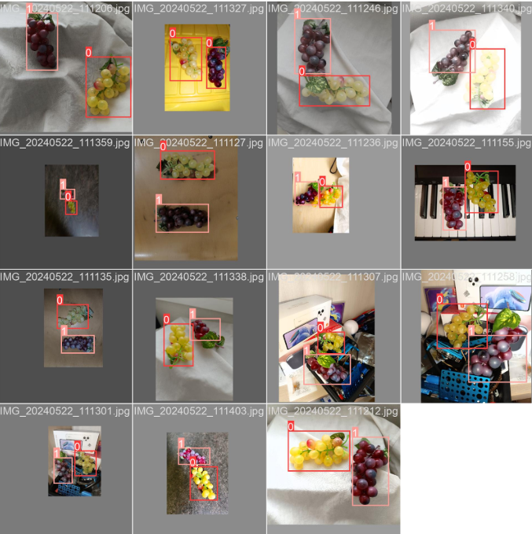
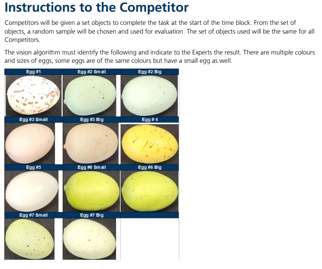
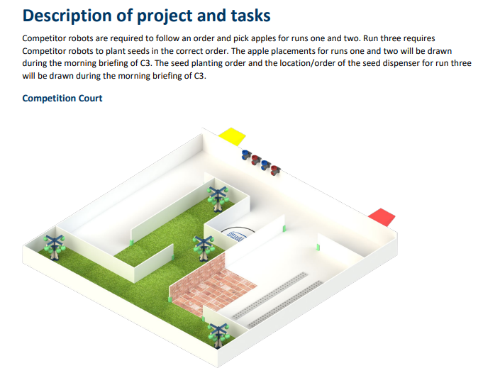

# WorldSkills Lyon 2024: The Final Chapter

<!-- grid-1 -->

    

<!-- end-grid -->

This project represents the culmination of my WorldSkills journey. Over eight months of intensive, self-directed work, I designed, built, and programmed an autonomous mobile manipulator from the ground up. This was my final competition, a platform to pour all my accumulated knowledge into a single, complex system.

Driven by a desire to push my limits, I built the entire software stack using **ROS2**. While I had coaching for guidance, the core solutions were born from countless hours of independent research, prototyping, and a relentless drive to engineer the best possible robot.

### My WorldSkills Journey in Medals

*From left to right: Bronze at Regionals, Silver at Nationals, and the Medallion for Excellence at the World Finals.*

---

## Robot Hardware & Design
The robot is a differential drive platform designed for both precise navigation and complex object manipulation.

- **Mobility**: Four motors with high-resolution encoders provide propulsion and odometry data.
- **Perception**: A Lidar for 360° mapping and a depth camera for 3D object detection form the robot's senses.
- **Manipulation**: A three-jointed robotic arm with a rotating base allows for a wide range of motion to grab, lift, and place objects.

    <iframe src="https://www.youtube.com/embed/AhZSpFj_UJo" frameborder="0" allow="accelerometer; autoplay; clipboard-write; encrypted-media; gyroscope; picture-in-picture" allowfullscreen style="position: absolute; top: 0; left: 0; width: 100%; height: 100%;"></iframe>

*A complete overview of the final robot design.*

#### Photo Gallery
<!-- grid-3 -->

    
    
    

<!-- end-grid -->

---

## Technical Deep Dive

### 1. Autonomous Navigation & Localization
I implemented a robust navigation stack by fusing data from multiple sensors to achieve high-accuracy localization and path planning.

- **Sensor Fusion for Odometry**: I combined wheel encoder data (tuned with a **PID controller** for accuracy) with Lidar data using the **RF2O odometry** algorithm. This fusion created a highly reliable estimate of the robot's movement, minimizing drift.
- **Mapping & Path Planning**: I used `slam_toolbox` for mapping, `AMCL` for localization within that map, and the full **Nav2** stack for intelligent path planning and execution.

<video src="../img/worldskills/lyon24/newpid.mp4" controls loop style="width: 100%; max-width: 700px; border-radius: 8px; display: block; margin: 1rem auto;"></video>
*Testing the feedback from motor encoders after PID tuning for precise velocity control.*

    <iframe src="https://www.youtube.com/embed/1ArNoJ4Ynxk" frameborder="0" allow="accelerometer; autoplay; clipboard-write; encrypted-media; gyroscope; picture-in-picture" allowfullscreen style="position: absolute; top: 0; left: 0; width: 100%; height: 100%;"></iframe>

*Demo of the full navigation stack: The robot uses a SLAM-generated map, AMCL, Nav2, and a Behavior Tree to autonomously locate and move towards a detected object.*

### 2. Advanced Task Management: Custom Behavior Trees
To manage the robot's complex decision-making, I went beyond standard tools. I manually integrated the powerful **BehaviorTree.CPP v3** library with ROS2 using a singleton pattern. This gave me complete control and flexibility.

- **Custom BT Nodes**: I developed a library of custom, reusable nodes for specific actions (e.g., "NavigateTo," "PickObject," "DetectEggs"), allowing me to construct sophisticated and adaptable behaviors.
- **Flexibility Under Pressure**: This custom architecture allowed me to rapidly modify the robot's logic during the competition to handle unexpected scenarios.

*Example of a Behavior Tree created for a specific task.*

### 3. Rapid Object Detection with YOLO
I implemented a highly efficient pipeline for object detection using **YOLO**. The key to my success was a **custom data augmentation script** I wrote.

- **Efficient Training**: My script allowed me to train a reliable model with very few sample images, generating hundreds of variations to make the model robust.
- **On-the-Fly Adaptability**: The entire process—from receiving a new object to deploying a trained model—took **less than five minutes**. This was a critical advantage in the dynamic competition environment.

*An example of the data augmentation script creating varied training data from a single image.*

<!-- grid-2 -->

    
    

<!-- end-grid -->

### 4. 3D Perception and Inverse Kinematics
To enable the robot to interact with its environment, I developed a full pipeline from 3D perception to physical manipulation.

1.  **3D Localization**: The depth camera identifies an object's location.
2.  **Coordinate Transformation**: ROS2 transforms the object's 3D coordinates from the camera's frame into the robot's base frame.
3.  **Inverse Kinematics (IK)**: My IK node calculates the precise joint angles required for the robotic arm to reach the target coordinates.
4.  **Execution**: The calculated angles are sent to the arm's motors.

<video src="../img/worldskills/lyon24/inversekinematics.mp4" controls loop style="width: 100%; max-width: 700px; border-radius: 8px; display: block; margin: 1rem auto;"></video>
*The arm uses inverse kinematics to follow the 3D position of detected objects in real-time.*

This system was decoupled, meaning the same IK node could control both the physical robot and a **Unity simulation**, simply by listening to the same ROS2 topic. This dramatically accelerated testing and development.

---

## Putting It to the Test: The Competition
The 4-day competition involved a series of complex modules that tested every aspect of the robot's design.

- **Object Detection Challenge**: A particularly difficult task involved identifying 12 different types of eggs with only subtle differences in size and color. My rapid training pipeline was essential here.

  
- **Autonomous Farming**: For two days, the robot had to perform dynamic tasks in a 4x4m court, such as harvesting "apples" and planting "seeds" based on randomized client orders, managed entirely by my Behavior Tree.

*An example of a competition module requiring navigation, perception, and manipulation.*