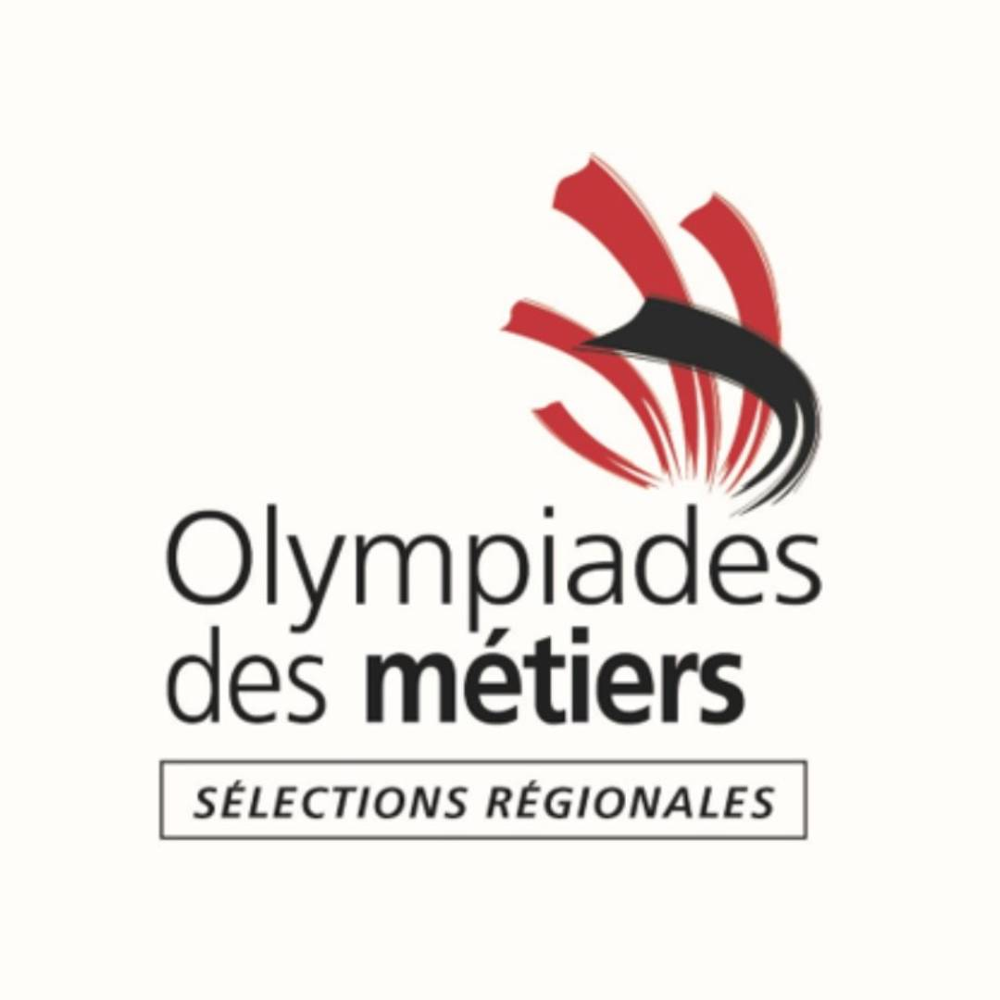
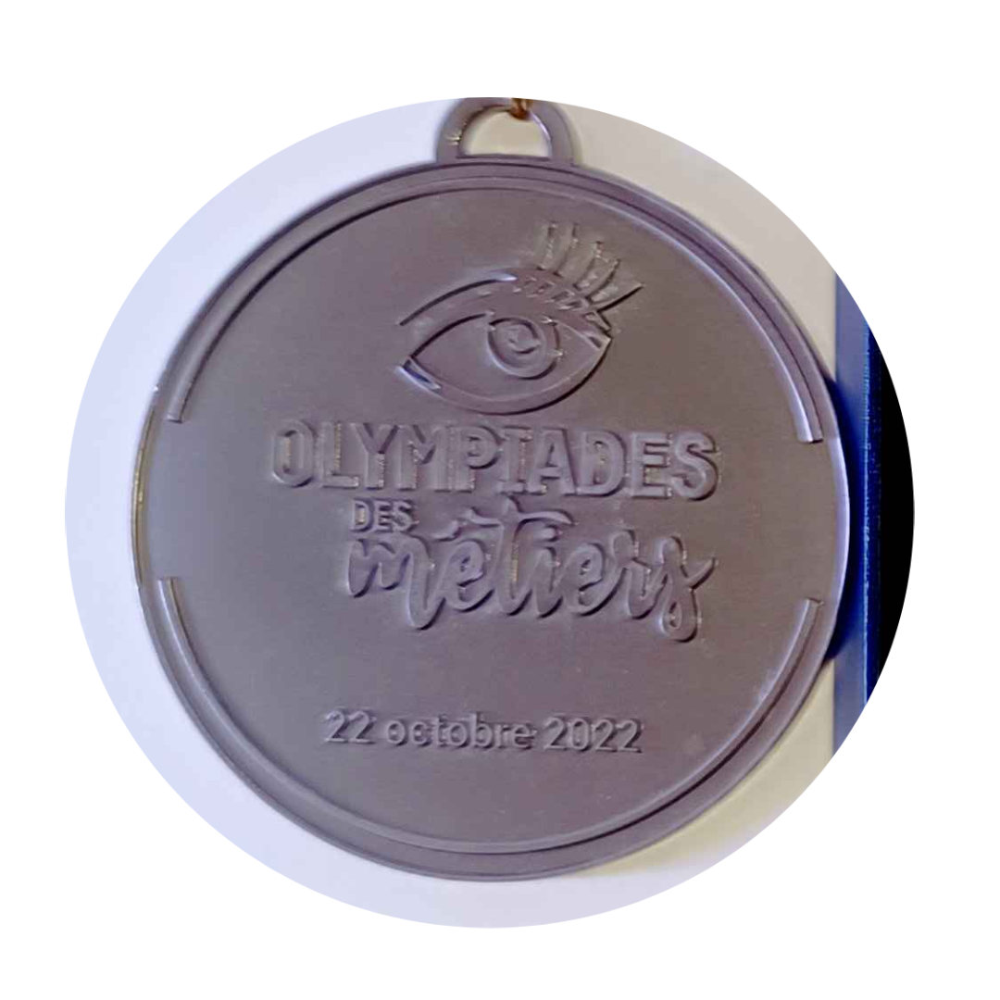
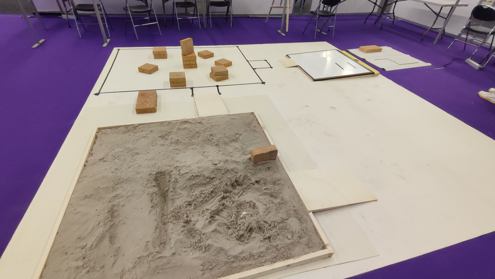
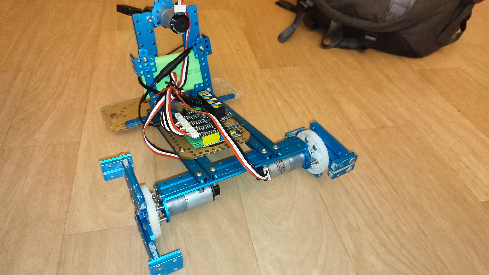
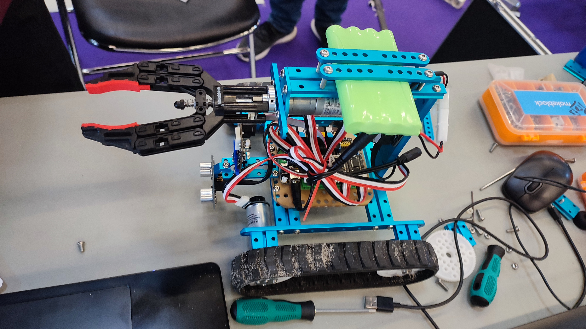

# WorldSkills Bordeaux 2022: Regional Competition

<!-- grid-2 -->

    
    

<!-- end-grid -->

## The Challenge: Trial by Fire
This was my entry into the world of competitive robotics. In a true test of rapid learning and problem-solving, **I enrolled on the morning the competition started** and learned everything I needed during the nights of the 3-day event, ultimately securing the **Bronze Medal**.

## Technical Achievements
The robot was programmed entirely in **Arduino C++** on an Arduino MegaPi. The focus was on raw logic and precise motor control to overcome a series of difficult physical challenges.

- **Challenging Terrain Navigation:** I programmed the robot to successfully traverse sand, a slippery slope, and a maze—all without tank tracks, demanding robust control algorithms.
- **Vision-Based Object Interaction:** Using a Pixy2 camera, I implemented a color-following algorithm. The robot could identify a randomly placed, colored cup and maneuver to a position to fill it with water.

### The Robot
<!-- grid-2 -->

    
    

<!-- end-grid -->

