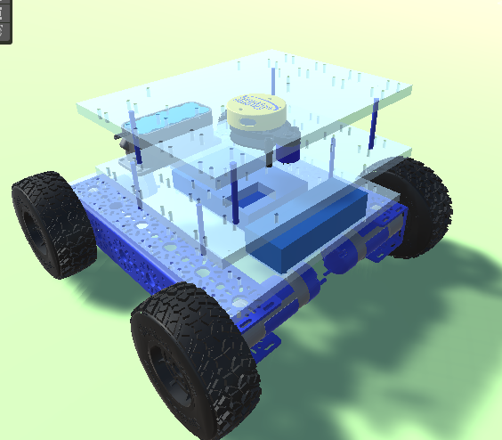
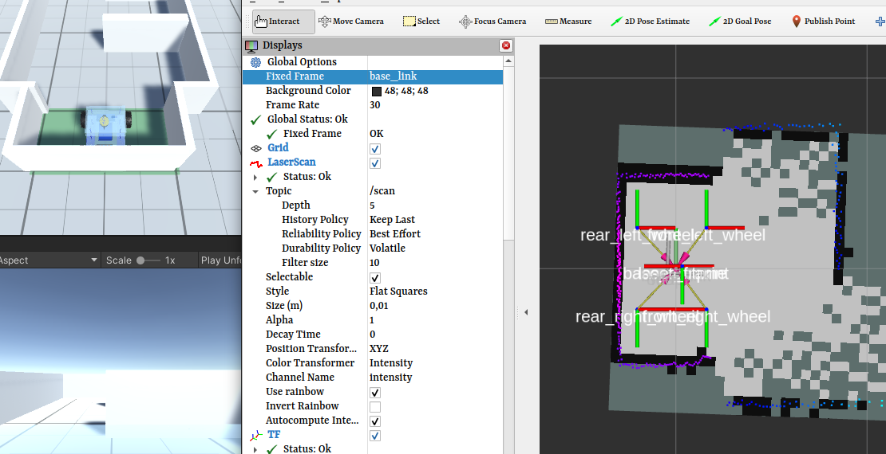
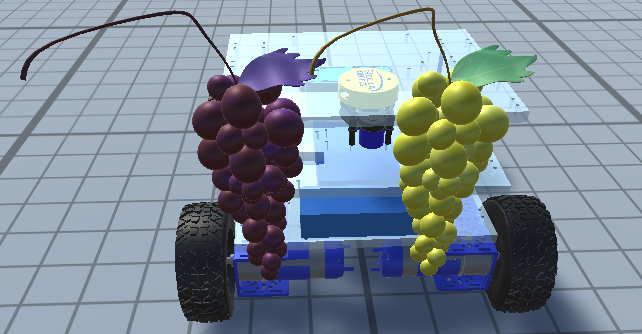
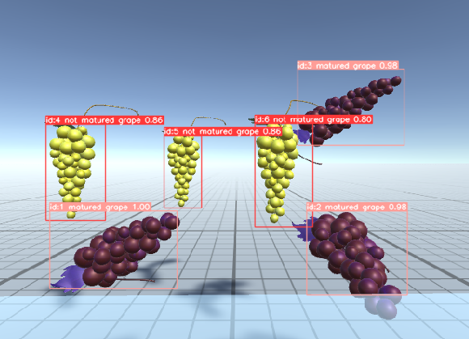
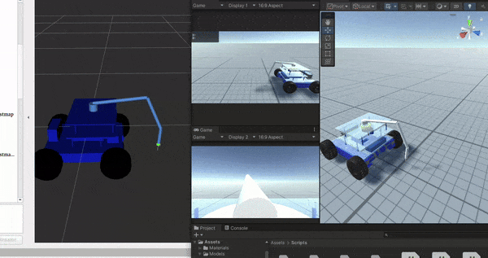
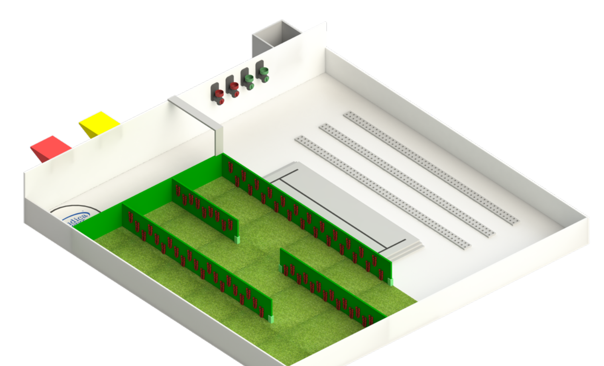
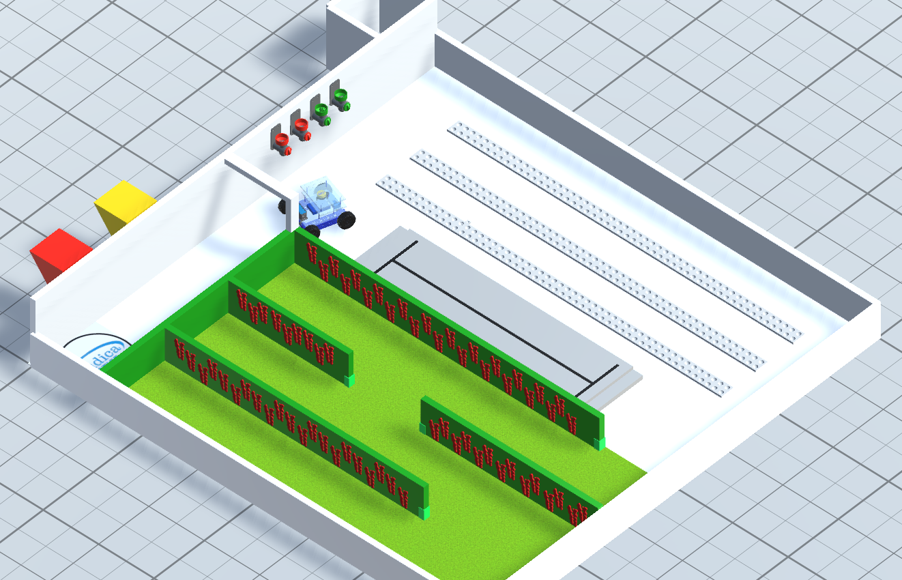

# Unity & ROS2 Integration

To accelerate development and enable rigorous testing for the WorldSkills competition, I created a high-fidelity digital twin of our robot in Unity. By bridging the simulation with my existing **ROS2 stack** using the `ros2-for-unity` package, I was able to develop and debug complex behaviors entirely in a virtual environment, saving countless hours of physical testing.

## 1. Building the Virtual Robot
The foundation of the simulation was creating an accurate virtual representation of the physical robot.

- **URDF Import**: I imported the robot's URDF file directly into Unity. This instantly provided an articulated model and allowed me to publish the robot's transform (TF) tree, which was visible in RViz2, confirming a perfect link between the simulation and the ROS ecosystem.
- **Physics-Based Movement**: I used Unity's physics engine to create a subscriber to the `/cmd_vel` topic, allowing my ROS2 navigation stack to control the robot's movement in the simulation just like the real hardware.

*The robot's URDF model, complete with all joints and links, loaded into the Unity scene.*

*The robot's transform tree, broadcasted from Unity, visualized in RViz2.*

## 2. Simulating the Senses
A digital twin is only useful if it can "see" its environment. I developed virtual sensors that precisely mimicked their real-world counterparts.

- **Simulated Lidar**: I developed a simulated Lidar from scratch in Unity, carefully matching the specs (range, frequency, field of view) and even adding simulated noise to mimic the real YDLIDAR X2. This allowed me to debug low-level sensor processing algorithms with perfect visibility of every single raycast.
- **Virtual Camera**: Similarly, a virtual camera was added, publishing images to the `/color/rgb/image_raw` topic. My existing **YOLO** detection stack worked seamlessly with this simulated video stream without any code changes.

    <iframe src="https://www.youtube.com/embed/lB7ceUKhDY4" frameborder="0" allow="accelerometer; autoplay; clipboard-write; encrypted-media; gyroscope; picture-in-picture" allowfullscreen style="position: absolute; top: 0; left: 0; width: 100%; height: 100%;"></iframe>

*Debugging a custom C++ navigation algorithm in the simulation. The goal was for the robot to always move towards the most open space based on Lidar data.*

<!-- grid-2 -->

    
    

<!-- end-grid -->
*The YOLO stack detecting objects rendered by the virtual camera in Unity.*

## 3. Integrating the Full ROS2 Stack
The true power of this digital twin was its ability to run my *entire* ROS2 software stack without modification.

- **SLAM & Navigation**: I could run `slam_toolbox` to map the virtual environment and then use the full **Nav2** stack (with `AMCL` and my custom **Behavior Trees**) to execute autonomous missions.
- **Manipulation**: I integrated the robotic arm by having Unity subscribe to the final joint positions published by my **Inverse Kinematics** node. This created a complete perception-to-action loop, perfect for testing complex manipulation tasks.

<video src="../img/worldskills/unity/nav2_2.mp4" controls loop style="width: 100%; max-width: 700px; border-radius: 8px; display: block; margin: 1rem auto;"></video>
*Robot navigating a map of my school, which was first created using SLAM on the real robot and then modeled in 3D in Unity. The exact same Nav2 stack is used.*

*A target point is published -> The IK node calculates joint angles -> The simulated arm moves to the target.*

## 4. The Result: An Invaluable Training Tool
With all systems integrated, the digital twin became an essential part of my preparation. I modeled the official competition environments in Unity, allowing me to test and refine my robot's behavior for specific tasks long before touching the physical hardware.

<!-- grid-2 -->

    
    

<!-- end-grid -->
*The official competition field, recreated in Unity to allow for realistic practice runs.*